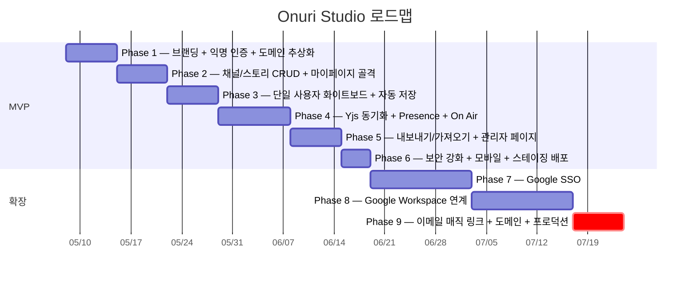

# Onuri Studio (온누리 스튜디오)

> **The studio where everyone tunes in.** — 모두의 스토리, 우리의 스튜디오.
>
> URL 한 줄로 입장하는 실시간 협업 화이트보드. 채널(Channel) → 스토리(Story) 구조에서 다중 사용자가 동시 편집한다.

-9A9AA8?style=flat-square)


[](https://github.com/jinhalim/onuri-studio)
[](docs/USER_MANUAL.md)

> ### 🎯 처음이신가요?
> **사용법 / 기능 / 스크린샷 / 데모 영상** 은 → **[📖 사용자 매뉴얼 (docs/USER_MANUAL.md)](docs/USER_MANUAL.md)**
>
> 라이브 데모 (테스트 모드): **[onuri-studio.vercel.app](https://onuri-studio.vercel.app)**

---

## 📌 프로젝트 상태 — Portfolio / Personal Use

본 프로젝트는 **상업화 목표 없이 포트폴리오 / 개인 사용 / 기술 학습 목적** 으로 유지됩니다.

| | |
|---|---|
| **단계** | MVP (Phase 1~6) 완료 + 확장 D-013 ~ D-021 적용. 추가 활성 개발 없음. |
| **운영** | Vercel + Supabase **무료 티어 한도 내** 에서만 운영. Google OAuth 는 testing 모드 (수동 등록). |
| **수익화** | 검토했으나 unit economics 비현실적 (FigJam / Miro / tldraw.com 등 자본·기능 압도적 + tldraw 상업 라이선스 비용 + 영업 비용 vs 예상 ARPU). 무료 운영 유지. |
| **개선 여지** | 있음 — 아래 [§ 미래 후보](#-미래-후보-future-candidates) 참조. 다만 적극적 로드맵 없음. |

> ⚠ tldraw v5 의 **Hobby License** 가 신청 완료 전까지 production (`onuri-studio.vercel.app`) 에선 캔버스가 5초 뒤 사라짐 (`display:none`). 로컬 dev (`localhost`) 에선 정상 동작.

---

## 🎯 왜 만들었는가 / 무엇을 배웠는가

### 동기
1. **실시간 협업 시스템** 을 처음부터 직접 만들어보고 싶었음 — CRDT vs LWW, presence, cursor sync, snapshot 보존, 재연결 복구 같은 문제들을 책이 아니라 코드로 부딪혀보기.
2. **shape-level customization** 이 필요한 캔버스 시스템 (tldraw v5 의 custom shape, custom style, custom toolbar) 의 실제 사용 한계 탐색.
3. **익명 + Google OAuth 병행 흐름** + **권한 요청·승인 inbox** 같은 비-trivial UX 패턴 직접 설계.
4. **Google Drive API + Picker SDK + drive.file scope** 의 실제 동작 / 함정 (예: `setAppId` 누락 시 404) 경험.

### 핵심으로 배운 것
| 주제 | 배운 것 |
|---|---|
| **Realtime sync** | Yjs CRDT 의 학습 비용이 크다 → 우리 MVP 는 Supabase Realtime broadcast + LWW 로 빠르게 ([D-010](#-결정-이력-decision-log)). 50명+ 운영 임박 시 비로소 Yjs 마이그레이션. **"문제 크기에 맞는 도구 선택"** 의 실전. |
| **tldraw v5** | `.configure({ getCustomDisplayValues })` 패턴 / closed TLShape union 우회 (`@ts-expect-error`) / OverflowingToolbar quirk / canEdit 과 setEditingShape 의 silent reject 동작. 라이브러리 내부를 직접 읽어야 풀리는 문제 많음. |
| **L1 abstraction** | tldraw 표면을 `lib/editor/index.ts` 단일 모듈로 추상화 ([D-016](#-결정-이력-decision-log)) — editor 교체 가능성 + 라이선스 검토 시점에 swap 가능한 구조. |
| **Schema 진화** | shape props 에 새 필드 추가 시 옛 snapshot 의 schema 검증 실패 → store 손상 → instance state 사라짐. pre-load migration 으로 우회. tldraw 의 schema migration API 보다 단순한 JSON 변환이 더 안전했음 ([§ 17.12](DESIGN.md#1712-d-019-후속-보강-구현-메모)). |
| **익명 + 회원 병행** | Supabase anon 세션이 없어서 Postgres Changes RLS 막힘 → broadcast 채널 + admin client 서버 액션 우회 ([D-015](#-결정-이력-decision-log)). |
| **OAuth scope 정책** | drive.file 같은 sensitive scope 는 verification 필요 (도메인 인증 + 데모 영상 + 약관). 소규모 indie 가 감당하기 큰 비용 → testing 모드 영구 운영 + 등록 요청 workflow ([D-021](#-결정-이력-decision-log)). |
| **운영 비용 직시** | Supabase Pro + Vercel Pro + tldraw 상업 라이선스 + 영업 비용 vs 예상 ARPU 계산 → 무료 운영이 정답이라는 결론. 기능보다 **단위 경제** 가 의사결정의 본질. |

### 다루지 않은 것 (의도적)
- **Yjs CRDT 본격 도입** — 학습 비용 + 25명 cap 으로 MVP 운영 가능해서 보류
- **이메일 매직 링크** — 도메인 + DKIM/SPF 인증 비용 vs 가치 판단 후 Phase 9 로 이연
- **모바일 native** — 화이트보드 UX 가 데스크탑/태블릿 중심
- **enterprise features** (SSO, audit log, admin controls) — 상업화 안 함

---

## 🛠 기술 하이라이트

각 항목은 [DESIGN.md § 17](DESIGN.md#17-결정-사항-decision-log) 의 구현 메모로 직접 연결. 채용 시연 / 코드 리뷰용 인덱스.

| 영역 | 결정 / 구현 | 다룬 트레이드오프 |
|---|---|---|
| **Realtime sync** | [D-010 + D-017](#-결정-이력-decision-log) — Supabase Realtime broadcast / presence + tldraw store diff (LWW). Smart autosave / Non-destructive reconnect / catch-up broadcast / 50ms batching / per-story 25명 정원 cap. | CRDT vs LWW 의 비용·복잡도 트레이드오프, 무료 티어 한도 안에서 50명 운영 대비 throttle 조정 ([§ 17.9](DESIGN.md#179-d-017-realtime-sync-hardening-구현-메모)) |
| **Custom canvas shapes** | [D-018 gdrive-file](DESIGN.md#1710-d-018-google-drive-연동-구현-메모) + [D-019 table](DESIGN.md#1711-d-019-tableshape--toolbar-70vw-구현-메모) + [D-020 note author](DESIGN.md#1712-d-019-후속-보강-구현-메모) | tldraw 의 closed type union 우회, schema 진화·migration, 셀 단위 인터랙션 (편집/병합/스타일), shape 내부 z-index 종속성 |
| **권한 요청 inbox** | [D-015](#-결정-이력-decision-log) — story-level 수정 권한 요청 / 승인 + Realtime broadcast (RLS 우회로 익명 사용자도 알림 수신) | 익명 세션의 RLS 제약, 알림 dedupe, owner 승인 후 페이지 리로드 vs router.refresh 트레이드오프 ([§ 17.6](DESIGN.md#176-d-015-수정-권한-요청-및-알림-시스템-구현-메모)) |
| **Google OAuth 운영** | [D-013](#-결정-이력-decision-log) Google SSO + [D-021](#-결정-이력-decision-log) 테스트 모드 영구 운영 → 등록 요청 workflow | Sensitive scope verification 비용 vs testing 모드 100명 한도의 운영 절충 |
| **Google Drive 깊이 연동** | [D-018 Phase 8b](DESIGN.md#1710-d-018-google-drive-연동-구현-메모) — Picker SDK + drive.file + Shortcut + 폴더 자동 생성 + viewer share + onDelete cleanup | client-side Drive API (server token 암호화 회피), Picker `setAppId` 함정, anyone-with-link share 의 graceful 403 |
| **Editor abstraction L1** | [D-016](#-결정-이력-decision-log) — `lib/editor/index.ts` 단일 re-export 모듈, 9개 소비처 일괄 적용 | 미래 editor swap 비용 (Excalidraw 등) vs 현재 코드 명확성 ([§ 17.8](DESIGN.md#178-editor-교체-대비-abstraction-가이드)) |
| **모바일·접근성 보강** | StylePanel 좁은 화면 드래그 차단 + 오버플로 스크롤 / Toolbar 70vw 임계점 조정 / `ForceDarkTheme` (스토리 페이지) / `data-theme` 분기 라이트/다크 ([D-012](#-결정-이력-decision-log)) | 좁은 viewport 에서의 UX, tldraw 의 native dblclick suppression 우회 |
| **운영·관측** | `/admin` 페이지 — Supabase 사용량 / 권한 이력 / 알림 / D-021 등록 요청 처리 | $0 예산 안에서 셀프 모니터링, Rate limit (Postgres 카운터 기반 — Redis 없이) |

---

## 📚 문서

| 문서 | 대상 | 용도 |
| --- | --- | --- |
| **[`docs/USER_MANUAL.md`](docs/USER_MANUAL.md)** | **일반 사용자** | **사용법 + 기능 소개 + 스크린샷 + 데모 영상** (16개 섹션, 첫 방문자 추천) |
| [`Claude.md`](Claude.md) | 개발자 / AI 도구 | 원본 프롬프트 (제품 정의서) — 결정 이력 부록 포함 |
| [`DESIGN.md`](DESIGN.md) | 개발자 | 기술 설계서 (폴더 구조 / API / DB / 인증) — § 17 결정 사항 |
| [`HANDOFF.md`](HANDOFF.md) | 개발자 / 새 세션 | 새 Claude 세션 / 다른 계정 / PC 에서 작업 재개 시 첫 참조 |
| `README.md` | 개발자 | **본 문서** — 진행 상황 + 결정 이력 트래커 |

---

## 📌 결정 이력 (Decision Log)

> 결정이 발생할 때마다 본 표 + [`DESIGN.md` § 17](DESIGN.md#17-결정-사항-decision-log) + [`Claude.md` 부록 A](Claude.md) **세 곳을 동시에** 갱신한다.

### ✅ 확정 결정

| 일자 | # | 항목 | 결정 |
| --- | --- | --- | --- |
| 2026-05-08 | D-001 | 도메인 | **`onuri.studio`** (Phase 9에서 구매·연결) |
| 2026-05-08 | D-002 | GitHub 저장소 | **[github.com/jinhalim/onuri-studio](https://github.com/jinhalim/onuri-studio)** |
| 2026-05-08 | D-003 | Supabase 프로젝트 | Phase 1 코드 작성 **직후** 생성 |
| 2026-05-08 | D-004 | 개발 진행 방식 | AI가 코드 작성 → 사용자 검토 (방식 A) |
| 2026-05-08 | D-005 | 패키지 매니저 | **pnpm** |
| 2026-05-08 | D-006 | UI 컴포넌트 라이브러리 | **shadcn/ui** |
| 2026-05-08 | D-007 | 익명 닉네임 색상 | 랜덤 배정 + **같은 채널 내 충돌 회피** ([§ 17.2](DESIGN.md#172-d-007-색상-충돌-회피-알고리즘-상세)) |
| 2026-05-08 | D-008 | 관리자 권한 부여 | MVP는 **SQL 직접**, 사용자 증가 시 `/admin` promote UI 추가 |
| 2026-05-08 | D-009 | Yjs 스냅샷 보존 | **일별 1개 + 직전 5개 롤링** ([§ 17.3](DESIGN.md#173-d-009-스냅샷-보존-구현-메모)) |
| 2026-05-08 | D-010 | Realtime 드라이버 *(O-008 해결)* | **Supabase Realtime broadcast + presence** (tldraw store diff, last-write-wins) |
| 2026-05-11 | D-011 | 캔버스 색상 — **전체 도형 임의 색** | tldraw `shape.meta.customColor` 에 hex 저장, 각 ShapeUtil `.configure({ getCustomDisplayValues })` 로 렌더 override. 기본 팔레트 + HTML color picker 병행 ([§ 17.5](DESIGN.md#175-d-011-임의-색상-지원-구현-메모)) |
| 2026-05-11 | D-012 | **라이트 모드 추가** | `html[data-theme]` CSS 변수 분기. system preference 감지 + localStorage + cookie. 헤더 sun/moon 토글. 스토리(화이트보드) 페이지는 다크 고정. accent 컬러 공유 |
| 2026-05-12 | D-013 | **Google SSO 활성화** *(O-012/O-016 부분 해결)* | `google-provider.ts` 어댑터 + `/auth/callback`. 익명 트랙 병행 유지. 닉네임은 별도 입력. 익명 흔적은 Google 계정에 흡수 |
| 2026-05-12 | D-014 | **사용자 유형별 권한 정책** | 익명: 닉네임 입력 강제(middleware) + 나가기 모달 (Google 연동 / 데이터 삭제) + 비-owner export 차단. Google 회원: admin 외 전체 기능, 나가기 시 세션만 종료 |
| 2026-05-13 | D-015 | **수정 권한 요청/승인 + 알림 inbox** *(O-015 부분 해결)* | **스토리 단위 / 영구 / DB 보관**. 비-owner 가 우상단 "읽기 전용" 배지 클릭 → owner 에게 `edit_request` 알림. owner 가 허용 시 `story_permissions.editor` 부여 + 요청자에게 승인 알림 → 클릭 시 페이지 리로드되며 편집 가능. Realtime push 는 broadcast 채널 `user-notifications:{userId}` (익명 사용자 Supabase 세션 부재 우회). 익명/Google 모두 동일 UX ([§ 17.6](DESIGN.md#176-d-015-수정-권한-요청-및-알림-시스템-구현-메모)) |
| 2026-05-13 | D-016 | **tldraw Hobby License attribution + Editor abstraction L1** | 비상업적 사용 명시 (README "📜 라이선스" + 랜딩 푸터 + [§ 17.7](DESIGN.md#177-tldraw-라이선스-가이드) 라이선스 가이드). `lib/editor/index.ts` 신설로 tldraw 사용 표면 (components / hooks / shape utils / types) 한곳에 re-export. 9개 소비처는 `@/lib/editor` 만 import. 미래 editor 교체 (Excalidraw 등) 시 본 파일에 동일 시그니처 adapter 만 만들면 swap 가능 ([§ 17.8](DESIGN.md#178-editor-교체-대비-abstraction-가이드)) |
| 2026-05-13 | D-017 | **Realtime sync hardening + per-story 정원 25명 제한** | Sync 코드 누적 흔적 정리 + 데이터 손실 핵심 케이스 차단 + 50명 대비 성능 폴리시 + 정원 cap. **Cleanup**: console.log 정리, 이중 fromUserId 안전망 제거, `flushSave`/`flushPendingSave` 통합, status 디바운스 1.5초로 단축, keepalive 45초로 늘림. **Quick wins**: Smart autosave (다른 사용자 그릴 때 연기 — owner snapshot 덮어쓰기 손실 차단), Non-destructive reconnect (replace → merge + catch-up broadcast), Broadcast throttle 50ms batching + dedupe. **50명 폴리시**: cursor 30Hz→15Hz, laser 60Hz→30Hz. **정원**: `MAX_STORY_PRESENCES = 25` — 초과 시 untrack + `OverflowNotice` 표시 (다시 시도 버튼만). 자동 재시도 없음. 50명 운영 시 Yjs CRDT 마이그레이션 필요 ([§ 17.9](DESIGN.md#179-d-017-realtime-sync-hardening-구현-메모)) |
| 2026-05-13 | D-018 | **Google Drive 연동 — Phase 8a + 8b 완료** *(O-013 부분 해결)* | **8a**: URL paste → `gdrive-file` custom shape → 클릭 시 split-screen iframe (Sheets `/edit`, 그 외 `/preview`) + 너비 resize 핸들. **8b**: `drive.file` scope + Google Picker SDK + 마이페이지 Workspace path 설정 + 폴더 자동 생성 (`{workspace}/{채널 [id]}/{스토리 [id]}/`) + Shortcut 첨부 (원본 보존) + 폴더 단위 anyone-with-link viewer share + onDelete cleanup hook. **모두 client-side Drive API** (session.provider_token). **Export**: `fileId`/`embedUrl` 제거 + `imported` flag stamp, import 측은 아이콘만 표시 ([§ 17.10](DESIGN.md#1710-d-018-google-drive-연동-구현-메모)) |
| 2026-05-14 | D-019 | **표 도구 (TableShape) + Toolbar 70vw inline 확장** | 신규 custom shape `'table'` — props (`rows`/`cols`/`cells`/`colWidths`/`rowHeights`/`cellMerges`/`cellStyles`) 모두 직렬화 가능 → 기존 broadcast sync 자동 처리. **셀 편집**: 더블클릭 (onPointerDown 직접 카운팅으로 tldraw native dblclick suppression 우회) → `<textarea>` 인라인 편집. **구조**: 우클릭 컨텍스트 메뉴로 행/열 임의 위치 추가·삭제 (max 50×20). **셀 병합**: Shift+클릭 다중 선택 → 우클릭 "선택한 셀들 병합" / 병합 셀에서 "병합 해제". **셀별 텍스트 스타일** (`cellStyles[]`): size (sm/md/lg/xl) + font (sans/serif/mono) + align (left/center/right) — 표 위쪽 mini-toolbar (활성값 표시 / mixed). customColor (StylePanel) 도 표 테두리/구분선에 반영. **Toolbar 확장**: `CustomToolbar` 가 `OverflowingToolbar` 임계점 `8/470` → `20/1200` 확장 + 표 grid picker (Excel hover 스타일) 는 `createPortal(document.body)` + `position: fixed` 로 boundary item 양쪽 렌더 quirk 회피. **호환성**: 옛 snapshot 의 누락 필드 (cellMerges/cellStyles) 는 loadSnapshot 전 pre-migration 으로 보정. Google Sheets 첨부 (D-018) 와 병행 ([§ 17.11](DESIGN.md#1711-d-019-tableshape--toolbar-70vw-구현-메모) + [§ 17.12](DESIGN.md#1712-d-019-후속-보강-구현-메모)) |
| 2026-05-14 | D-020 | **노트 작성자 라벨 z-index 통일** | 기존 `NoteAuthorLayer` 는 viewport overlay (z-20) 라 노트가 다른 도형에 가려져도 라벨이 위에 떠 있던 버그. 해결: `CustomNoteShapeUtilWithAuthor` (NoteShapeUtil subclass) 의 `component()` override 로 author 라벨을 노트의 HTMLContainer 안에 inline 렌더 → tldraw shape z-index 에 자동 종속. 다른 도형이 노트를 덮으면 라벨도 함께 가려짐. customColor 동작은 base class `.configure({getCustomDisplayValues})` 로 보존 |

### ⏳ 미해결 (사용자 검토 대기)

| # | 항목 | 결정 시점 | 비고 |
| --- | --- | --- | --- |
| ~~O-008~~ | ~~Realtime 드라이버~~ | **✅ D-010 으로 해결** | Supabase Realtime 채택 |
| O-009 | **썸네일 생성 방식** (클라이언트 캡처 vs 서버 puppeteer) | Phase 2 또는 Phase 5 | Channel Guide 페이지의 스토리 카드 미리보기 그림 용도 |
| ~~O-012~~ | ~~SSO 우선순위~~ | **✅ D-013 부분 해결 (Google 채택)** | GitHub/Microsoft/Apple 등은 별도 결정 |
| ~~O-013~~ | ~~Google Workspace 통합 깊이~~ | **✅ D-018 부분 해결 (Phase 8a PoC + 8b 본격, Picker + drive.file + Shortcut)** | 양방향 동기화 / Sheets webhook 은 별도 |
| O-014 | **이메일 발신자 표기** | Phase 9 도메인 인증 시 | |
| ~~O-015~~ | ~~채널 권한 시스템~~ | **✅ D-015 부분 해결 (스토리 단위 수정 권한)** | 채널 단위 권한 / 대표 이미지 등은 별도 |
| ~~O-016~~ | ~~인증 방식 — 이메일 대신 다른 방식~~ | **✅ D-013 부분 해결 (Google SSO)** | 이메일 매직링크는 D-EMAIL 로 Phase 9 까지 보류 |

---

## 📊 전체 진행률

```
전체:        [████████████████░░░░]  78%   (~7.0 / 9 phases)
MVP (1~6):   [████████████████████]  98%   (~5.9 / 6 phases)
확장 (7~9):  [████████░░░░░░░░░░░░]  37%   (~1.1 / 3 phases)
```

> 위 바는 Phase 단위. 한 Phase 안의 세부 체크리스트는 [§ Phase별 체크리스트](#-phase별-체크리스트) 참조.
> **최근 적용 결정** (2026-05-14): D-019 표 도구 보강 (셀 병합 + 셀별 텍스트 스타일 + mini-toolbar + grid picker portal + snapshot pre-migration) · **D-020** 노트 작성자 라벨 z-index 통일. `HANDOFF.md` 신설 — 새 세션/계정/PC 에서 작업 재개 가이드.
> **인프라**: Vercel 스테이징 배포 완료 ([onuri-studio.vercel.app](https://onuri-studio.vercel.app)). Supabase 무료 티어 사용량은 `/admin` 페이지에서 실시간 확인 가능.

---

## 🗓 타임라인 (Gantt)



---

## 🚦 Phase 상태 보드

| Phase | 제목                                          | 상태   | 진행률                 |
| ----- | --------------------------------------------- | ------ | ---------------------- |
| 1     | 브랜딩 + 익명 인증 + 도메인 추상화            | ✅ 완료 | `[██████████] 100%` |
| 2     | 채널/스토리 CRUD + 마이페이지 골격            | ✅ 완료 | `[██████████] 100%` |
| 3     | 단일 사용자 화이트보드 + 자동 저장            | ✅ 완료 | `[██████████] 100%` |
| 4     | Realtime 동기화 + Presence + On Air           | ✅ 완료* | `[██████████] 100%` |
| 5     | 내보내기/가져오기 + 관리자                    | ✅ 완료 | `[██████████] 100%` |
| 6     | 보안 강화 + 모바일 + 스테이징                 | 🟢 진행 | `[█████████░]  90%` |
| 7     | Google SSO *(확장)*                           | 🟢 진행 | `[███░░░░░░░]  30%` |
| 8     | Google Workspace 연계 *(확장)*                | 🟢 진행 | `[████████░░]  80%` |
| 9     | 이메일 매직 링크 + 도메인 + 프로덕션 *(확장)* | ⏸ 대기 | `[░░░░░░░░░░]   0%` |

> 범례: ✅ 완료 · 🟢 진행 중 · ⏳ 다음 차례 · ⏸ 대기
> *Phase 4 는 **D-010** (Supabase Realtime broadcast) 으로 완료. 50명 동시 운영 필요 시 Yjs CRDT 마이그레이션 별도 결정 ([`DESIGN.md` § 17.9](DESIGN.md#179-d-017-realtime-sync-hardening-구현-메모)).

---

## ✅ Phase별 체크리스트

각 항목은 PR 또는 커밋이 머지될 때 체크한다. 세부 산출물 정의는 [`DESIGN.md`](DESIGN.md)의 § 13 참조.

<details>
<summary><b>Phase 1 — 브랜딩 + 익명 인증 + 도메인 추상화</b> ✅</summary>

**코드 작업** (완료):
- [x] **pnpm** + Next.js 14 App Router + TypeScript + Tailwind 프로젝트 초기화 *(D-005)*
- [x] **shadcn/ui** 인프라 (`components.json` + `lib/utils.ts cn` 헬퍼) *(D-006)*
- [x] 디자인 토큰 정의 (`app/globals.css` CSS 변수 + Tailwind preset)
- [x] `Wordmark` 컴포넌트 ("Onuri"의 dotless ı 위에 빨간 점)
- [x] 환경변수 검증 (`lib/config/env.ts` zod 스키마)
- [x] URL 헬퍼 (`lib/config/urls.ts`)
- [x] Supabase 클라이언트/서버/admin 어댑터 (`lib/infra/supabase/`)
- [x] 마이그레이션 SQL 4개 작성 (`supabase/migrations/0001~0004`)
- [x] `AuthProviderAdapter` 인터페이스 + `provider-registry.ts`
- [x] `anonymous-provider.ts` 구현 (닉네임 + httpOnly 쿠키)
- [x] **`assign-anonymous-color.ts`** 유즈케이스 — 색상 충돌 회피 + HSL fallback *(D-007)*
- [x] `email-provider.ts` **stub** (`isEnabled() => RESEND_API_KEY && EMAIL_FROM`) — Phase 9 대비
- [x] `useOnuriAuth` 훅 + `OnuriAuthProvider` 컨텍스트
- [x] 랜딩 페이지 (`[스튜디오 켜기]` 단일 CTA + Setup 배너)
- [x] `pnpm install` (Next 14.2 / React 18.3 / Supabase ssr / zod / nanoid 등)
- [x] `pnpm run typecheck` 통과
- [x] `pnpm run dev` 부팅 + `GET / 200 OK` 검증

**사용자 작업** (완료):
- [x] supabase.com 무료 프로젝트 생성 *(D-003)*
- [x] `.env.local` 작성 (URL / anon key / service_role key)
- [x] SQL Editor에서 `supabase/migrations/0001~0004.sql` 차례로 실행
- [x] 닉네임 입장 → 색상 자동 배정 + 세션 유지 동작 확인

</details>

<details>
<summary><b>Phase 2 — 채널/스토리 CRUD + 마이페이지 골격</b> ✅</summary>

**도메인/유즈케이스**:
- [x] `lib/security/validators` — channelNameSchema / storyTitleSchema 추가
- [x] `lib/usecases/create-channel.ts` (nanoid 12자, 충돌 시 5회 재시도)
- [x] `lib/usecases/list-my-channels.ts`
- [x] `lib/usecases/get-channel-with-stories.ts`
- [x] `lib/usecases/create-story.ts` (기본 제목 "이름 N" 자동)
- [x] `lib/usecases/delete-story.ts`
- [x] `lib/usecases/record-participation.ts` (방문 시 `last_visited_at` 갱신)

**Server Actions**:
- [x] `app/actions/create-channel.ts`
- [x] `app/actions/create-story.ts`
- [x] `app/actions/delete-story.ts`

**컴포넌트**:
- [x] `components/channel/StoryCard.tsx` (썸네일/제목/마지막 수정일/On Air placeholder)
- [x] `components/channel/ChannelList.tsx`
- [x] `components/channel/CreateChannelForm.tsx`
- [x] `components/channel/CreateStoryButton.tsx`
- [x] `components/channel/DeleteStoryButton.tsx`
- [x] `components/share/ShareButton.tsx` (URL 클립보드 복사)

**페이지**:
- [x] `app/page.tsx` 갱신 — 로그인 시 채널 목록 + 새 채널 만들기
- [x] `app/ch/[channelId]/page.tsx` — Channel Guide
- [x] `app/me/page.tsx` — 마이페이지 (익명도 자기 채널 목록 확인 가능)

**검증**:
- [x] typecheck / lint / build 통과
- [x] 채널 생성 → URL 공유 → 다른 브라우저로 조회 확인
- [x] 스토리 생성 / 삭제 / participations 기록 확인

</details>

<details>
<summary><b>Phase 3 — 단일 사용자 화이트보드 + 자동 저장</b> ✅</summary>

**저장 형식 결정**: tldraw 네이티브 snapshot (JSON, migration 0006 에서 bytea → text 로 변경 — Supabase REST API round-trip 호환). D-010 에서 Yjs 후순위로 결정.

**유즈케이스 / Server Actions**:
- [x] `lib/usecases/save-story-snapshot.ts` (text 저장 + snapshot_updated_at)
- [x] `lib/usecases/load-story-snapshot.ts`
- [x] `lib/usecases/update-story-title.ts`
- [x] `app/actions/save-story-snapshot.ts` (1.5초 debounce + D-017 Smart autosave 연기)
- [x] `app/actions/update-story-title.ts`

**컴포넌트**:
- [x] `components/canvas/StudioCanvas.tsx` (tldraw 래퍼 + auto-save listener + D-016 abstraction)
- [x] `components/story/StoryTitleInline.tsx` (상태 머신: idle ↔ editing ↔ saving)
- [x] tldraw 기본 도구바 그대로 사용 (펜/사각형/원/화살표/텍스트/스티키/지우개 + 단축키 자동)

**페이지**:
- [x] `app/ch/[channelId]/story/[storyId]/page.tsx` (whiteboard)

**검증**:
- [x] typecheck / lint / build 통과
- [x] 브라우저: 도형 그리기 → 1.5초 후 자동 저장 → 새로고침 시 복원
- [x] 제목 인라인 편집: Enter/blur 저장, Esc 롤백, 빈 값 롤백

</details>

<details>
<summary><b>Phase 4 — Realtime 동기화 + Presence + On Air</b> ✅</summary>

**드라이버 결정 (D-010)**: Supabase Realtime broadcast + presence. tldraw store diff 를 last-write-wins 으로 전송. Yjs 마이그레이션은 후순위 (50명 운영 시점에 재검토 — D-017).

- [x] D-010 결정 (O-008 해결)
- [x] `lib/hooks/useStoryRealtime` (채널 구독 + broadcast + presence track)
- [x] `lib/hooks/useChannelPresence` (Channel Guide 라이브 도트용 별도 채널)
- [x] `components/brand/OnAirIndicator` (Tailwind animate-pulse-rec)
- [x] `components/canvas/PresenceLayer` (다른 사용자 커서 + 닉네임 라벨)
- [x] `components/presence/PresenceList` (헤더용 접속자 도트 + tooltip)
- [x] `StudioCanvas` 통합:
  - [x] 사용자 변경 감지 → broadcast (owner / 권한자만)
  - [x] 원격 변경 수신 → `editor.store.mergeRemoteChanges()` 로 무한 루프 방지
  - [x] 포인터 이동 → presence cursor 갱신 (15Hz 스로틀, D-017)
  - [x] 레이저 포인터 broadcast (공유/비공유 모드 + SVG 글로우 오버레이)
  - [x] On Air 표시 (presence.isDrawing 기반)
- [x] 두 브라우저로 동기화 확인
- [x] **D-017 sync hardening**: console.log cleanup / Smart autosave / Non-destructive reconnect / Broadcast throttle 50ms batching / cursor 30Hz→15Hz / laser 60Hz→30Hz / **per-story 25명 정원 제한 + OverflowNotice**

> **50명 운영 필요 시 후속**: Yjs CRDT 마이그레이션 ([`DESIGN.md` § 17.9](DESIGN.md#179-d-017-realtime-sync-hardening-구현-메모)).

</details>

<details>
<summary><b>Phase 5 — 내보내기/가져오기 + 관리자</b> ✅</summary>

- [x] `OnuriFile` v1 스키마 + zod 검증 (`lib/domain/onuri-file.ts`)
- [x] `.onuri.json` / `.png` / `.svg` 내보내기 (`ExportButton`, tldraw 빌트인 + 커스텀 직렬화)
- [x] 가져오기 (드래그앤드롭 + 파일 선택, `import-story.ts` 액션)
- [x] Import 시 병합/새 스토리 선택 다이얼로그
- [x] 마이페이지 히스토리 (최근 방문 / 즐겨찾기 `getMyHistory`, `FavoriteToggle`)
- [x] **마이페이지 권한 이력 섹션** (D-015 후속) — 받은 / 부여한 권한 + 해제 기능
- [x] `/admin` 통계 페이지 (role=admin guard, `getAdminDashboard`)
- [x] **`/admin` Supabase 무료 티어 사용량 표시** — DB 용량 추정 / Auth 사용자 / 테이블별 row + Dashboard 링크
- [x] 사용자/채널/스토리 검색 (admin)
- [x] **D-014 적용**: 익명 + 비-owner 채널에선 ExportButton 숨김

</details>

<details open>
<summary><b>Phase 6 — 보안 + 모바일 + 스테이징</b> 🟢</summary>

- [x] RLS 정책 적용 (migration 0004 + 0010 — stories / channels / participations / users / story_permissions / notifications)
- [x] middleware 로 익명 사용자 URL 접속 가드 + next 보존 (D-014)
- [x] 닉네임 / 채널명 / 스토리 제목 XSS 위험 문자 거부 (validators — `<>` 등 거부 + React JSX 자동 escape 콤보로 3중 방어)
- [x] open redirect 방지 (sign-in 액션 next 파라미터 검증)
- [x] 모바일/태블릿 safe-area + viewport + 헤더 wrap 대응
- [x] 라이트/다크 모드 (D-012) — system preference 자동 감지 + 영속화
- [x] **D-014 사용자 유형별 권한 정책** (익명/Google 분기)
- [x] **D-015 스토리 단위 수정 권한 요청/승인**
- [x] **D-016 tldraw Hobby License attribution + Editor abstraction L1**
- [x] **D-017 Realtime sync hardening + per-story 25명 정원 제한**
- [x] **Rate Limit 적용** — Supabase Postgres 기반 (`rate_limit_counters` migration 0011, $0 예산). 채널 생성 5회/분, 스토리 생성 20회/분, 권한 요청 5회/분
- [x] **ESLint custom rules** — `tldraw` 직접 import 금지 (D-016 강제) + `@/lib/infra/supabase/admin` 클라이언트 import 차단 + `SUPABASE_SERVICE_ROLE_KEY` 클라이언트 참조 차단
- [x] **Vercel 스테이징 배포** (`onuri-studio.vercel.app`) — 환경변수 8종 등록 완료 (Google SSO 키 포함). tldraw 라이선스 키만 발급 대기
- [ ] WCAG AA 점검 + Lighthouse 모바일/접근성 90+
- [ ] *(조건부)* DOMPurify — 현재 코드 surface 에선 불필요 (JSX 자동 escape + zod `<>` 거부 + `dangerouslySetInnerHTML` 0건 으로 이미 안전). 향후 markdown / rich text / 댓글 도입 시 추가
- [ ] *(조건부)* 파일 업로드 magic byte 재검증 — 사용자 파일 업로드 기능 본격 도입 시

</details>

<details>
<summary><b>Phase 7 — Google SSO</b> 🟢 (확장)</summary>

**D-013 적용** (2026-05-12): Google SSO 만 활성, GitHub/Microsoft/Apple 은 별도 결정 시 추가.

- [x] Google Cloud Console OAuth 클라이언트 생성 + redirect URI 등록
- [x] `google-provider.ts` 구현 (`signInWithOAuth({ provider: 'google' })`)
- [x] `/auth/callback` 라우트로 OAuth code 교환
- [x] `/auth/setup-nickname` — Google 로그인 직후 닉네임 입력 UX (익명과 동일)
- [x] `provider-registry.ts` 에 `google` 활성화
- [x] 익명 → Google 계정 흡수 (`anonymous_sessions.converted_user_id` + 데이터 transfer, `transfer-anonymous-to-user.ts`)
- [x] 마이페이지 ProviderBadge (Google 아이콘 표시)
- [ ] GitHub SSO (별도 결정 필요)
- [ ] Microsoft SSO (별도 결정 필요)
- [ ] Apple SSO (별도 결정 필요)

</details>

<details>
<summary><b>Phase 8 — Google Workspace 연계</b> 🟢 (확장)</summary>

**D-018 적용** (2026-05-13): Phase 8a (PoC) + 8b (본격) — Google Drive 첨부 완료.

**Phase 8a — URL paste + 임베드** ✅
- [x] tldraw 의 새 custom shape `gdrive-file` (mime type 별 아이콘/색)
- [x] URL paste 모달 + 자동 파서 (Sheets / Docs / Slides / Drive 공유 링크)
- [x] split-screen iframe 패널 (Sheets `/edit` / 그 외 `/preview`)
- [x] 좌측 핸들로 패널 너비 resize

**Phase 8b — Picker + 폴더 자동 생성 + Shortcut** ✅
- [x] migration 0012 (workspace/folder/attachments 컬럼/테이블)
- [x] 마이페이지 Drive Workspace 설정 섹션 (Google 사용자 한정)
- [x] Google Picker SDK + Drive API client-side wrapper
- [x] 첨부 흐름: workspace ensure → 채널/스토리 폴더 ensure → Picker → Shortcut → DB
- [x] 폴더 단위 anyone-with-link viewer 권한 자동 share
- [x] Workspace 없을 때 Hybrid 안내 (빠른 설정 / 마이페이지)
- [x] onDelete hook (shape 삭제 시 DB row + Drive shortcut cleanup)
- [x] Export `.onuri.json` 시 `fileId`/`embedUrl` 제거 + `imported` flag stamp
- [ ] 채널/스토리 rename → Drive 폴더 자동 rename (선택, deferred)
- [ ] 양방향 동기화 (Sheets webhook 등) — O-013 잔여 결정 사항

> ⚠ Drive API 호출은 모두 **client-side** (`session.provider_token` + `gapi.client.drive`).
> 서버 측 token 암호화 / refresh 불필요 — 사용자 active 상태에서만 첨부/삭제.

**USER prerequisites** (모두 사용자가 직접 설정):
- Google Cloud Console: Drive API + Picker API 활성 + drive.file scope + API key
- Supabase Google provider: Additional scope `drive.file` 추가
- Vercel + .env.local: `NEXT_PUBLIC_GOOGLE_API_KEY`
- Supabase SQL Editor: migration `0012_gdrive_integration.sql` 실행

</details>

<details>
<summary><b>Phase 9 — 이메일 매직 링크 + 커스텀 도메인 + 프로덕션</b> ⏸ (확장)</summary>

- [ ] 도메인 구매 (예: `onuri.studio`)
- [ ] DNS 설정 + Vercel 도메인 연결
- [ ] Resend 도메인 인증 (DKIM/SPF/DMARC)
- [ ] `.env` 갱신 (`NEXT_PUBLIC_APP_URL`, `RESEND_API_KEY`, `EMAIL_FROM`)
- [ ] Supabase Auth Redirect URL 갱신
- [ ] OAuth Redirect URL 갱신 (Phase 7 활성화한 경우)
- [ ] `email-provider.ts` 본문 구현 (`signInWithOtp` + `handleCallback`)
- [ ] `provider-registry.ts`에서 `email: null` → `emailProvider`
- [ ] `MagicLinkForm` 컴포넌트 노출
- [ ] `/auth/callback`에서 `convert-anonymous-to-member` 호출
- [ ] 마이페이지 `[이메일로 저장]` 버튼 (익명 사용자 한정)
- [ ] 익명 자산 이전 무결성 E2E 테스트
- [ ] Vercel 프로덕션 배포

</details>

---

## 🛠 기술 스택

| 영역 | 선택 | 비용 |
| --- | --- | --- |
| 패키지 매니저 | **pnpm** *(D-005)* | 무료 |
| 프론트엔드 | Next.js 14 App Router + TypeScript + TailwindCSS | 무료 |
| UI 컴포넌트 | **shadcn/ui** *(D-006)* | 무료 |
| 캔버스 | tldraw | 무료 |
| 실시간 | Yjs + (드라이버 미정 — Phase 4 PoC, *O-008*) | 무료 티어 |
| DB + 인증 | Supabase Free (500MB / 50K MAU) | 무료 |
| 이메일 | Resend Free (3,000통/월) | 무료 *(Phase 9)* |
| 호스팅 | Vercel Hobby | 무료 |
| 도메인 | **`onuri.studio`** *(D-001, Phase 9 구매)* | 사용자 결정 |

---

## 🚀 빠른 시작

```bash
pnpm install               # 의존성 설치 (pnpm 내장 명령)
cp .env.example .env.local # Supabase 키 입력 후 저장
pnpm run dev               # http://localhost:3000
pnpm run typecheck         # 타입 검사
pnpm run build             # 프로덕션 빌드
pnpm run lint              # ESLint
```

Supabase 미설정 상태에서도 dev 서버는 부팅되며, 랜딩 페이지에 **빨간 Setup 배너**가 노출됩니다. 닉네임 입장 시도 시까지는 Supabase 호출이 발생하지 않으므로 UI/디자인 토큰 검수는 즉시 가능합니다.

### pnpm 명령 규칙

| 명령 종류 | 형식 | 예시 |
| --- | --- | --- |
| pnpm **내장** 명령 | `pnpm <cmd>` | `pnpm install`, `pnpm add zod`, `pnpm update` |
| **package.json scripts** | `pnpm run <script>` | `pnpm run dev`, `pnpm run typecheck` |

**왜 분리하는가**: `pnpm dev`처럼 `run`을 생략해도 동작하지만, 미래에 누군가 `install`/`init`/`update` 같은 내장 명령과 동명의 script를 추가하면 의도치 않게 내장 명령이 실행됩니다. 명시적으로 `pnpm run`을 쓰면 그런 사고가 원천 차단됩니다.

> 위험한 script 이름 (사용 금지): `install`, `init`, `add`, `remove`, `update`, `publish`, `pack`, `audit`, `exec`, `dlx`, `list`, `outdated`, `prune`, `root`, `bin`, `env`, `patch`, `config`, `licenses`, `import`, `create`, `server`, `store`, `recursive`

---

## 🔮 미래 후보 (Future Candidates)

> 본 프로젝트는 **포트폴리오 모드** 입니다. 아래 항목들은 **만약** 수익화 / 개선 / 재시동 시점에 재검토할 후보 목록일 뿐, 활성 로드맵이 아닙니다.

### 운영 안정화 (수익화 안 해도 가치 있는 항목)

- [ ] **tldraw Hobby License 신청 + 등록** — production 캔버스 5초 사라짐 이슈 해결 (가장 큰 미해결 항목)
- [ ] **WCAG AA 점검 + Lighthouse 모바일/접근성 90+** — Phase 6 의 마지막 미체크
- [ ] **`/me` GoogleLinkSection 레이아웃 정리** — 현재 dt/dd 분리 적용, 원래대로 합치되 텍스트 overflow 처리 (D-021 미완료)
- [ ] 채널/스토리 rename 시 Drive 폴더 동기 rename (D-018 deferred)
- [ ] O-009 Channel Guide 카드 썸네일 자동 생성

### 본격 사용자 확장 시 (50명+ 동시)

- [ ] **Yjs CRDT 마이그레이션** — tldraw `useYjsStore` + Supabase Storage 의 Y.Doc binary 영속 ([§ 17.9](DESIGN.md#179-d-017-realtime-sync-hardening-구현-메모))
- [ ] 현재는 D-017 의 25명 cap + Quick wins 로 운영 가능 (Overflow 발생 시 OverflowNotice)

### 상업 / 공개 launch 결정 시

- [ ] tldraw **Hobby License → 상업 SDK License 구매** ([§ 17.7](DESIGN.md#177-tldraw-라이선스-가이드)) 또는 **Excalidraw 등 대안 editor 로 swap** ([§ 17.8](DESIGN.md#178-editor-교체-대비-abstraction-가이드))
- [ ] 도메인 구매 (`onuri.studio`) + DNS + 프로덕션 환경변수 갱신 (Phase 9)
- [ ] **개인정보 처리방침 / 이용약관** 페이지 작성
- [ ] **Google OAuth 검토 제출** — drive.file sensitive scope verification (도메인 인증 + 데모 영상 + 약관)
- [ ] Phase 9: 이메일 매직 링크 (Resend 도메인 인증 + DKIM/SPF)
- [ ] Supabase Pro 전환 시점 판단 (`/admin` 페이지의 사용량 모니터링 활용)

### 사용자 확장 기능 (있으면 좋음)

- [ ] DOMPurify — markdown / rich text / 댓글 도입 시
- [ ] 파일 업로드 magic byte 재검증 — 사용자 파일 본격 도입 시
- [ ] 음성/영상 채팅 통합
- [ ] 모바일 native 앱 (React Native or PWA 강화)

---

## 🧭 새로 저장소 받은 사람 (Onboarding)

1. **[`docs/USER_MANUAL.md`](docs/USER_MANUAL.md)** 로 결과물 먼저 확인 (스크린샷 + 데모 영상)
2. **[`HANDOFF.md`](HANDOFF.md)** 로 환경 설정 + 현재 상태 파악
3. [`Claude.md`](Claude.md) 부록 A — 제품 비전 / 결정 이력
4. [`DESIGN.md`](DESIGN.md) § 17 — 구현 메모 (CRDT / 라이선스 / abstraction / sync 등)
5. Supabase 무료 프로젝트 생성 → `.env.local` 작성 + `supabase/migrations/0001~0013.sql` 순차 실행
6. `pnpm install && pnpm run dev`

---

## 📜 라이선스

본 저장소 코드: MIT — see [`LICENSE`](LICENSE).

### Third-party Licenses

| 라이브러리 | 라이선스 | 비고 |
| --- | --- | --- |
| [tldraw](https://tldraw.dev) | **Hobby License** (비상업적 사용만 허용) | 현재 본 프로젝트는 비상업적 학습/포트폴리오 용도. 3.x 는 워터마크 포함. 상업 사용 시 [tldraw SDK License](https://tldraw.dev/community/license) 별도 구매 필요 ([§ 17.7](DESIGN.md#177-tldraw-라이선스-가이드)) |
| Next.js, React, Supabase, lucide-react 등 | MIT / Apache 2.0 | 상업 자유 |

> ⚠ **상업 전환 (수익화 / 회사 운영 / 광고 등) 시점에 tldraw SDK License 구매 필요.** 자가 진단 기준은 [`DESIGN.md` § 17.7](DESIGN.md#177-tldraw-라이선스-가이드) 참고.
