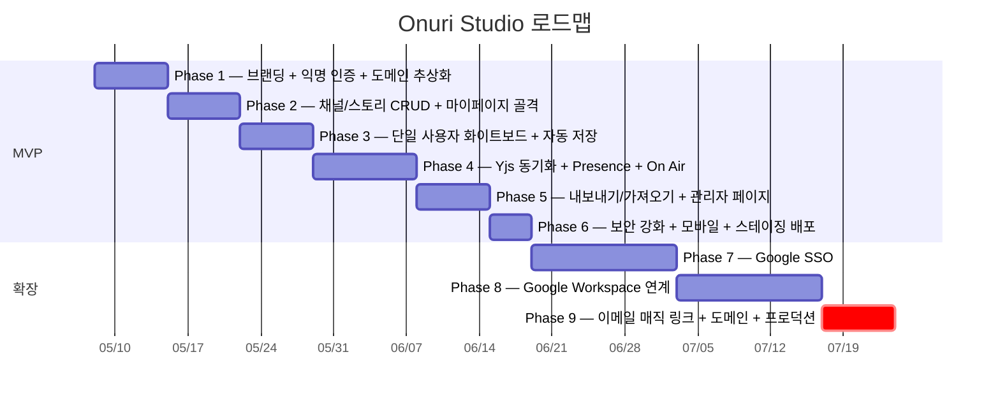

# Onuri Studio (온누리 스튜디오)

> **The studio where everyone tunes in.** — 모두의 방송, 우리의 스튜디오.
>
> URL 한 줄로 입장하는 실시간 협업 화이트보드. 채널(Channel) → 스토리(Story) 구조에서 다중 사용자가 Yjs CRDT로 동시 편집한다.


[](https://github.com/jinhalim/onuri-studio)

---

## 📚 문서

| 문서 | 용도 |
| --- | --- |
| [`Claude.md`](Claude.md) | AI 코딩 도구에 붙여넣는 **원본 프롬프트** (제품 정의서) — 결정 이력 부록 포함 |
| [`DESIGN.md`](DESIGN.md) | 구현 가능한 형태의 **기술 설계서** (폴더 구조 / API / DB / 인증) — § 17 결정 사항 포함 |
| `README.md` | **본 문서** — 진행 상황 + 결정 이력 트래커 |

---

## 📌 결정 이력 (Decision Log)

> 결정이 발생할 때마다 본 표 + [`DESIGN.md` § 17](DESIGN.md#17-결정-사항-decision-log) + [`Claude.md` 부록 A](Claude.md) **세 곳을 동시에** 갱신한다.

### ✅ 확정 결정

| 일자 | # | 항목 | 결정 |
| --- | --- | --- | --- |
| 2026-05-08 | D-001 | 도메인 | **`onuri.studio`** (Phase 9에서 구매·연결) |
| 2026-05-08 | D-002 | GitHub 저장소 | **[github.com/jinhalim/onuri-studio](https://github.com/jinhalim/onuri-studio)** |
| 2026-05-08 | D-003 | Supabase 프로젝트 | Phase 1 코드 작성 **직후** 생성 |
| 2026-05-08 | D-004 | 개발 진행 방식 | AI가 코드 작성 → 사용자 검토 (방식 A) |
| 2026-05-08 | D-005 | 패키지 매니저 | **pnpm** |
| 2026-05-08 | D-006 | UI 컴포넌트 라이브러리 | **shadcn/ui** |
| 2026-05-08 | D-007 | 익명 닉네임 색상 | 랜덤 배정 + **같은 채널 내 충돌 회피** ([§ 17.2](DESIGN.md#172-d-007-색상-충돌-회피-알고리즘-상세)) |
| 2026-05-08 | D-008 | 관리자 권한 부여 | MVP는 **SQL 직접**, 사용자 증가 시 `/admin` promote UI 추가 |
| 2026-05-08 | D-009 | Yjs 스냅샷 보존 | **일별 1개 + 직전 5개 롤링** ([§ 17.3](DESIGN.md#173-d-009-스냅샷-보존-구현-메모)) |
| 2026-05-08 | D-010 | Realtime 드라이버 *(O-008 해결)* | **Supabase Realtime broadcast + presence** (tldraw store diff, last-write-wins) |

### ⏳ 미해결 (사용자 검토 대기)

| # | 항목 | 결정 시점 | 비고 |
| --- | --- | --- | --- |
| ~~O-008~~ | ~~Realtime 드라이버~~ | **✅ D-010 으로 해결** | Supabase Realtime 채택 |
| O-009 | **썸네일 생성 방식** (클라이언트 캡처 vs 서버 puppeteer) | Phase 2 또는 Phase 5 | Channel Guide 페이지의 스토리 카드 미리보기 그림 용도 |
| O-012 | **SSO 우선순위** (Google만 / Google+GitHub / 4종) | Phase 7 시작 전 | |
| O-013 | **Google Workspace 통합 깊이** | Phase 8 시작 전 | |
| O-014 | **이메일 발신자 표기** | Phase 9 도메인 인증 시 | |

---

## 📊 전체 진행률

```
전체:        [██████░░░░░░░░░░░░░░]  33%   (3 / 9 phases)
MVP (1~6):   [██████████░░░░░░░░░░]  50%   (3 / 6 phases)
확장 (7~9):  [░░░░░░░░░░░░░░░░░░░░]   0%   (0 / 3 phases)
```

> 위 바는 Phase 단위. 한 Phase 안의 세부 체크리스트는 [§ Phase별 체크리스트](#-phase별-체크리스트) 참조.

---

## 🗓 타임라인 (Gantt)



---

## 🚦 Phase 상태 보드

| Phase | 제목                                          | 상태   | 진행률                 |
| ----- | --------------------------------------------- | ------ | ---------------------- |
| 1     | 브랜딩 + 익명 인증 + 도메인 추상화            | ✅ 완료 | `[██████████] 100%` |
| 2     | 채널/스토리 CRUD + 마이페이지 골격            | ✅ 완료 | `[██████████] 100%` |
| 3     | 단일 사용자 화이트보드 + 자동 저장            | ✅ 완료 | `[██████████] 100%` |
| 4     | Realtime 동기화 + Presence + On Air           | 🟢 진행 | `[░░░░░░░░░░]   0%` |
| 5     | 내보내기/가져오기 + 관리자                    | ⏸ 대기 | `[░░░░░░░░░░]   0%` |
| 6     | 보안 강화 + 모바일 + 스테이징                 | ⏸ 대기 | `[░░░░░░░░░░]   0%` |
| 7     | Google SSO *(확장)*                           | ⏸ 대기 | `[░░░░░░░░░░]   0%` |
| 8     | Google Workspace 연계 *(확장)*                | ⏸ 대기 | `[░░░░░░░░░░]   0%` |
| 9     | 이메일 매직 링크 + 도메인 + 프로덕션 *(확장)* | ⏸ 대기 | `[░░░░░░░░░░]   0%` |

> 범례: ✅ 완료 · 🟢 진행 중 · ⏳ 다음 차례 · ⏸ 대기

---

## ✅ Phase별 체크리스트

각 항목은 PR 또는 커밋이 머지될 때 체크한다. 세부 산출물 정의는 [`DESIGN.md`](DESIGN.md)의 § 13 참조.

<details>
<summary><b>Phase 1 — 브랜딩 + 익명 인증 + 도메인 추상화</b> ✅</summary>

**코드 작업** (완료):
- [x] **pnpm** + Next.js 14 App Router + TypeScript + Tailwind 프로젝트 초기화 *(D-005)*
- [x] **shadcn/ui** 인프라 (`components.json` + `lib/utils.ts cn` 헬퍼) *(D-006)*
- [x] 디자인 토큰 정의 (`app/globals.css` CSS 변수 + Tailwind preset)
- [x] `Wordmark` 컴포넌트 ("Onuri"의 dotless ı 위에 빨간 점)
- [x] 환경변수 검증 (`lib/config/env.ts` zod 스키마)
- [x] URL 헬퍼 (`lib/config/urls.ts`)
- [x] Supabase 클라이언트/서버/admin 어댑터 (`lib/infra/supabase/`)
- [x] 마이그레이션 SQL 4개 작성 (`supabase/migrations/0001~0004`)
- [x] `AuthProviderAdapter` 인터페이스 + `provider-registry.ts`
- [x] `anonymous-provider.ts` 구현 (닉네임 + httpOnly 쿠키)
- [x] **`assign-anonymous-color.ts`** 유즈케이스 — 색상 충돌 회피 + HSL fallback *(D-007)*
- [x] `email-provider.ts` **stub** (`isEnabled() => RESEND_API_KEY && EMAIL_FROM`) — Phase 9 대비
- [x] `useOnuriAuth` 훅 + `OnuriAuthProvider` 컨텍스트
- [x] 랜딩 페이지 (`[스튜디오 켜기]` 단일 CTA + Setup 배너)
- [x] `pnpm install` (Next 14.2 / React 18.3 / Supabase ssr / zod / nanoid 등)
- [x] `pnpm run typecheck` 통과
- [x] `pnpm run dev` 부팅 + `GET / 200 OK` 검증

**사용자 작업** (완료):
- [x] supabase.com 무료 프로젝트 생성 *(D-003)*
- [x] `.env.local` 작성 (URL / anon key / service_role key)
- [x] SQL Editor에서 `supabase/migrations/0001~0004.sql` 차례로 실행
- [x] 닉네임 입장 → 색상 자동 배정 + 세션 유지 동작 확인

</details>

<details>
<summary><b>Phase 2 — 채널/스토리 CRUD + 마이페이지 골격</b> ✅</summary>

**도메인/유즈케이스**:
- [ ] `lib/security/validators` — channelNameSchema / storyTitleSchema 추가
- [ ] `lib/usecases/create-channel.ts` (nanoid 12자, 충돌 시 5회 재시도)
- [ ] `lib/usecases/list-my-channels.ts`
- [ ] `lib/usecases/get-channel-with-stories.ts`
- [ ] `lib/usecases/create-story.ts` (기본 제목 "이름 N" 자동)
- [ ] `lib/usecases/delete-story.ts`
- [ ] `lib/usecases/record-participation.ts` (방문 시 `last_visited_at` 갱신)

**Server Actions**:
- [ ] `app/actions/create-channel.ts`
- [ ] `app/actions/create-story.ts`
- [ ] `app/actions/delete-story.ts`

**컴포넌트**:
- [ ] `components/channel/StoryCard.tsx` (썸네일/제목/마지막 수정일/On Air placeholder)
- [ ] `components/channel/ChannelList.tsx`
- [ ] `components/channel/CreateChannelForm.tsx`
- [ ] `components/channel/CreateStoryButton.tsx`
- [ ] `components/channel/DeleteStoryButton.tsx`
- [ ] `components/share/ShareButton.tsx` (URL 클립보드 복사)

**페이지**:
- [ ] `app/page.tsx` 갱신 — 로그인 시 채널 목록 + 새 채널 만들기
- [ ] `app/ch/[channelId]/page.tsx` — Channel Guide
- [ ] `app/me/page.tsx` — 마이페이지 (익명도 자기 채널 목록 확인 가능)

**검증**:
- [ ] typecheck / lint / build 통과
- [ ] 채널 생성 → URL 공유 → 다른 브라우저로 조회 확인
- [ ] 스토리 생성 / 삭제 / participations 기록 확인

</details>

<details>
<summary><b>Phase 3 — 단일 사용자 화이트보드 + 자동 저장</b> ✅</summary>

**저장 형식 결정**: tldraw 네이티브 snapshot (JSON → bytea). Phase 4에서 Yjs로 전환.

**유즈케이스 / Server Actions**:
- [ ] `lib/usecases/save-story-snapshot.ts` (bytea 저장)
- [ ] `lib/usecases/load-story-snapshot.ts` (bytea → JSON 복원)
- [ ] `lib/usecases/update-story-title.ts`
- [ ] `app/actions/save-story-snapshot.ts` (5초 debounce 클라이언트에서 호출)
- [ ] `app/actions/update-story-title.ts`

**컴포넌트**:
- [ ] `components/canvas/StudioCanvas.tsx` (tldraw 래퍼 + auto-save listener)
- [ ] `components/story/StoryTitleInline.tsx` (상태 머신: idle ↔ editing ↔ saving)
- [ ] tldraw 기본 도구바 그대로 사용 (펜/사각형/원/화살표/텍스트/스티키/지우개 + 단축키 자동)

**페이지**:
- [ ] `app/ch/[channelId]/story/[storyId]/page.tsx` (whiteboard)

**검증**:
- [ ] typecheck / lint / build 통과
- [ ] 브라우저: 도형 그리기 → 5초 후 자동 저장 → 새로고침 시 복원
- [ ] 제목 인라인 편집: Enter/blur 저장, Esc 롤백, 빈 값 롤백

</details>

<details open>
<summary><b>Phase 4 — Realtime 동기화 + Presence + On Air</b> 🟢</summary>

**드라이버 결정 (D-010)**: Supabase Realtime broadcast + presence. tldraw store diff 를 last-write-wins 으로 전송. Yjs 마이그레이션은 후순위.

- [x] D-010 결정 (O-008 해결)
- [ ] `lib/hooks/useStoryRealtime` (채널 구독 + broadcast + presence track)
- [ ] `components/brand/OnAirIndicator` (Tailwind animate-pulse-rec)
- [ ] `components/canvas/PresenceLayer` (다른 사용자 커서 + 닉네임 라벨)
- [ ] `StudioCanvas` 통합:
  - [ ] 사용자 변경 감지 → broadcast (소유자만, 방문자는 수신만)
  - [ ] 원격 변경 수신 → `editor.store.mergeRemoteChanges()`로 무한 루프 방지
  - [ ] 포인터 이동 → presence cursor 갱신 (60fps 스로틀)
  - [ ] On Air 표시 (누군가 그리는 중 표시)
- [ ] 두 브라우저로 50ms 이내 동기화 확인

</details>

<details>
<summary><b>Phase 5 — 내보내기/가져오기 + 관리자</b> ⏸</summary>

- [ ] `OnuriFile` v1 스키마 + zod 검증
- [ ] `GET /api/export/:storyId` (`.onuri.json` 다운로드)
- [ ] `.png` / `.svg` 내보내기 (tldraw 빌트인)
- [ ] `POST /api/import` (드래그앤드롭 + 파일선택)
- [ ] Import 시 병합/새 스토리 선택 다이얼로그
- [ ] 마이페이지 히스토리 (최근 방문 / 즐겨찾기)
- [ ] `/admin` 통계 페이지 (role=admin guard)
- [ ] 사용자/채널/스토리 검색

</details>

<details>
<summary><b>Phase 6 — 보안 + 모바일 + 스테이징</b> ⏸</summary>

- [ ] RLS 정책 침투 테스트
- [ ] Rate Limit 적용 (채널 5/분, 스토리 20/분 등)
- [ ] DOMPurify로 XSS 방어
- [ ] 파일 업로드 magic byte 재검증
- [ ] Service Role 키 클라이언트 번들 차단 (ESLint custom rule)
- [ ] 모바일/태블릿 터치 대응
- [ ] WCAG AA 점검
- [ ] Lighthouse 모바일/접근성 90+
- [ ] Vercel 스테이징 배포 (`onuri-studio.vercel.app`)

</details>

<details>
<summary><b>Phase 7 — Google SSO</b> ⏸ (확장)</summary>

- [ ] Google Cloud Console OAuth 클라이언트 생성
- [ ] `google-provider.ts` 구현
- [ ] `provider-registry.ts`에 `google` 활성화
- [ ] AuthGate에 `[Google로 시작]` 버튼 자동 노출 확인
- [ ] 계정 연결(linked_providers) 흐름

</details>

<details>
<summary><b>Phase 8 — Google Workspace 연계</b> ⏸ (확장)</summary>

- [ ] 별도 OAuth scope (drive.file/spreadsheets/presentations)
- [ ] `external_integrations` 테이블 활성 사용 + 토큰 암호화
- [ ] 화이트보드에 Sheets/Slides 임베드 컴포넌트
- [ ] `OnuriFile.external` 필드 채움

</details>

<details>
<summary><b>Phase 9 — 이메일 매직 링크 + 커스텀 도메인 + 프로덕션</b> ⏸ (확장)</summary>

- [ ] 도메인 구매 (예: `onuri.studio`)
- [ ] DNS 설정 + Vercel 도메인 연결
- [ ] Resend 도메인 인증 (DKIM/SPF/DMARC)
- [ ] `.env` 갱신 (`NEXT_PUBLIC_APP_URL`, `RESEND_API_KEY`, `EMAIL_FROM`)
- [ ] Supabase Auth Redirect URL 갱신
- [ ] OAuth Redirect URL 갱신 (Phase 7 활성화한 경우)
- [ ] `email-provider.ts` 본문 구현 (`signInWithOtp` + `handleCallback`)
- [ ] `provider-registry.ts`에서 `email: null` → `emailProvider`
- [ ] `MagicLinkForm` 컴포넌트 노출
- [ ] `/auth/callback`에서 `convert-anonymous-to-member` 호출
- [ ] 마이페이지 `[이메일로 저장]` 버튼 (익명 사용자 한정)
- [ ] 익명 자산 이전 무결성 E2E 테스트
- [ ] Vercel 프로덕션 배포

</details>

---

## 🛠 기술 스택

| 영역 | 선택 | 비용 |
| --- | --- | --- |
| 패키지 매니저 | **pnpm** *(D-005)* | 무료 |
| 프론트엔드 | Next.js 14 App Router + TypeScript + TailwindCSS | 무료 |
| UI 컴포넌트 | **shadcn/ui** *(D-006)* | 무료 |
| 캔버스 | tldraw | 무료 |
| 실시간 | Yjs + (드라이버 미정 — Phase 4 PoC, *O-008*) | 무료 티어 |
| DB + 인증 | Supabase Free (500MB / 50K MAU) | 무료 |
| 이메일 | Resend Free (3,000통/월) | 무료 *(Phase 9)* |
| 호스팅 | Vercel Hobby | 무료 |
| 도메인 | **`onuri.studio`** *(D-001, Phase 9 구매)* | 사용자 결정 |

---

## 🚀 빠른 시작

```bash
pnpm install               # 의존성 설치 (pnpm 내장 명령)
cp .env.example .env.local # Supabase 키 입력 후 저장
pnpm run dev               # http://localhost:3000
pnpm run typecheck         # 타입 검사
pnpm run build             # 프로덕션 빌드
pnpm run lint              # ESLint
```

Supabase 미설정 상태에서도 dev 서버는 부팅되며, 랜딩 페이지에 **빨간 Setup 배너**가 노출됩니다. 닉네임 입장 시도 시까지는 Supabase 호출이 발생하지 않으므로 UI/디자인 토큰 검수는 즉시 가능합니다.

### pnpm 명령 규칙

| 명령 종류 | 형식 | 예시 |
| --- | --- | --- |
| pnpm **내장** 명령 | `pnpm <cmd>` | `pnpm install`, `pnpm add zod`, `pnpm update` |
| **package.json scripts** | `pnpm run <script>` | `pnpm run dev`, `pnpm run typecheck` |

**왜 분리하는가**: `pnpm dev`처럼 `run`을 생략해도 동작하지만, 미래에 누군가 `install`/`init`/`update` 같은 내장 명령과 동명의 script를 추가하면 의도치 않게 내장 명령이 실행됩니다. 명시적으로 `pnpm run`을 쓰면 그런 사고가 원천 차단됩니다.

> 위험한 script 이름 (사용 금지): `install`, `init`, `add`, `remove`, `update`, `publish`, `pack`, `audit`, `exec`, `dlx`, `list`, `outdated`, `prune`, `root`, `bin`, `env`, `patch`, `config`, `licenses`, `import`, `create`, `server`, `store`, `recursive`

---

## 🧭 다음 작업 (Onboarding)

이 저장소를 처음 받은 사람이 해야 할 일:

1. [`Claude.md`](Claude.md) 통독 — 제품 비전 / 인증 정책 / 데이터 모델
2. [`DESIGN.md`](DESIGN.md) 통독 — 폴더 구조와 Phase 1 산출물 확인
3. Supabase 무료 프로젝트 생성 → URL/anon key 확보
4. Phase 1 체크리스트 첫 항목부터 순서대로 처리

---

## 📜 라이선스

MIT — see [`LICENSE`](LICENSE).
