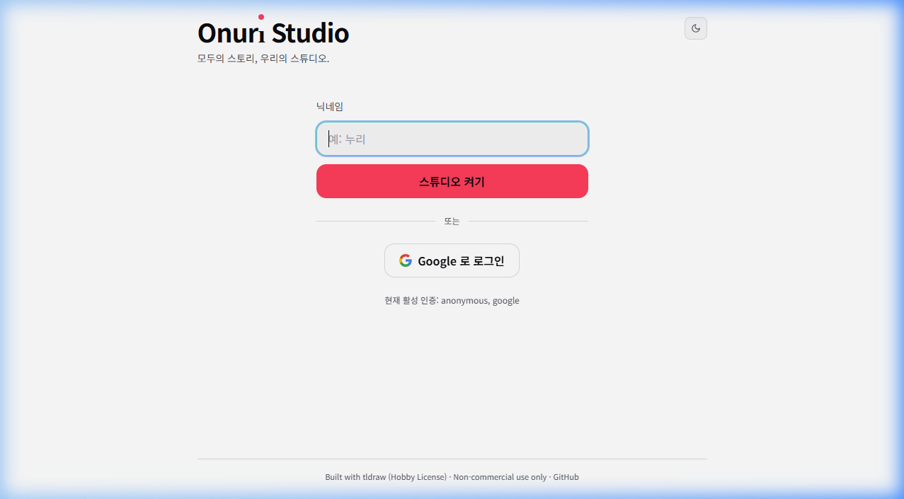
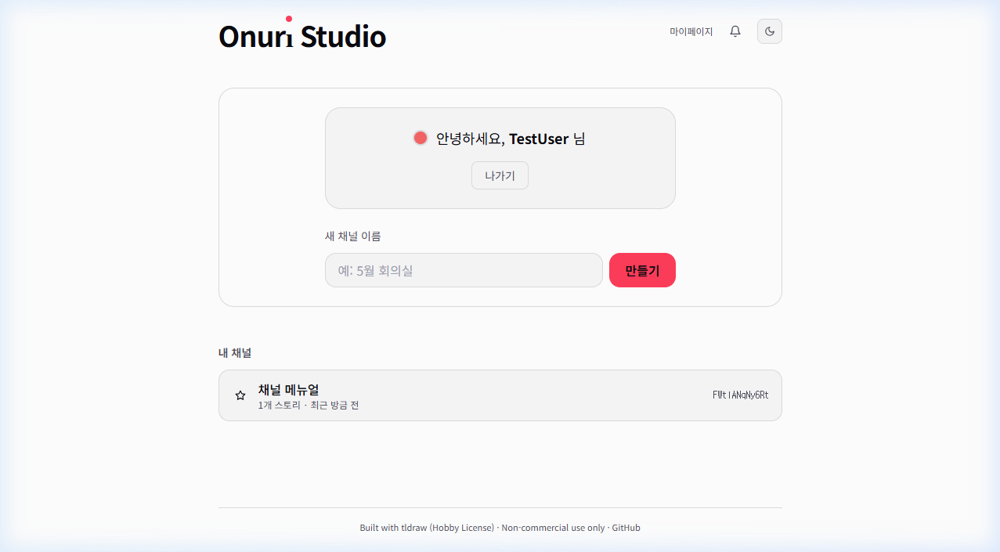
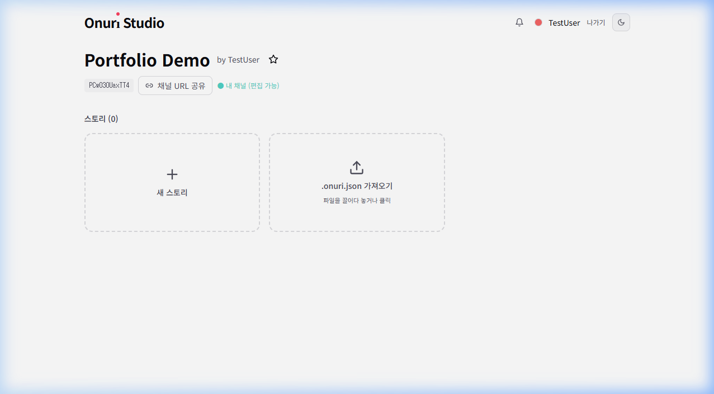
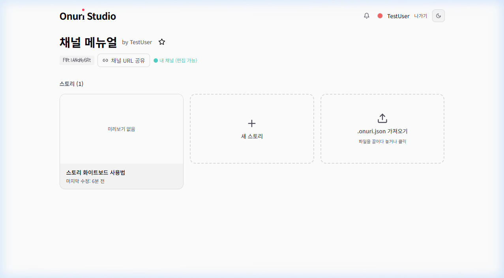
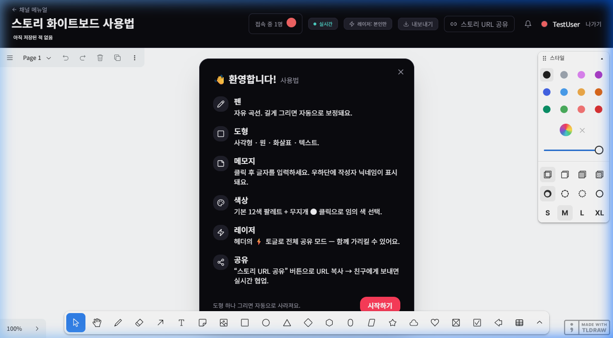
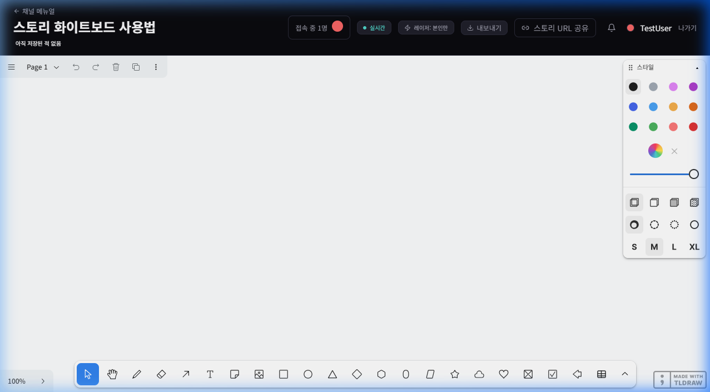
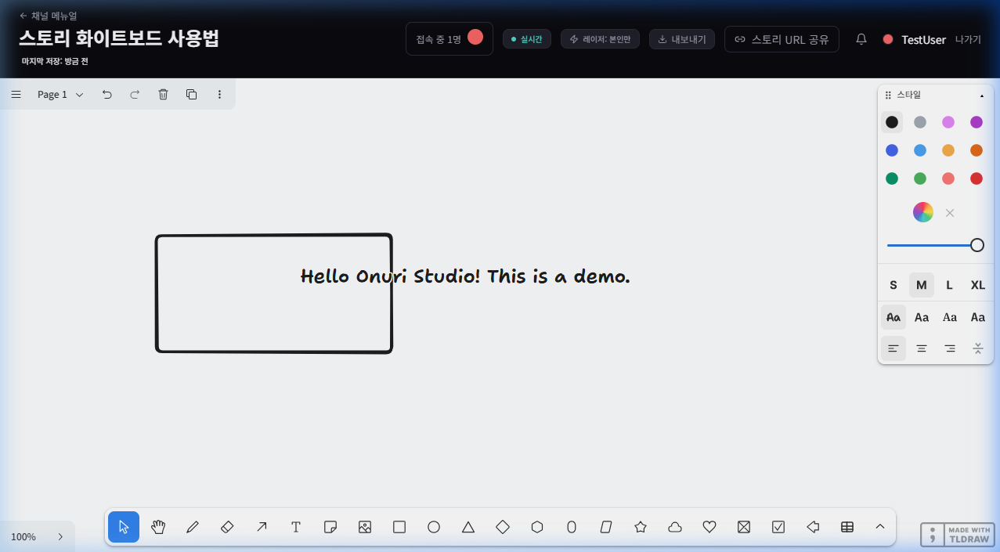
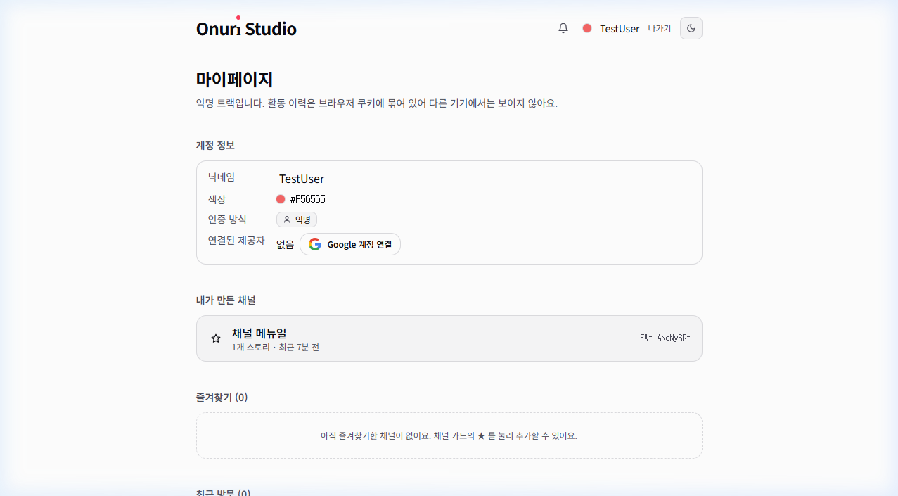
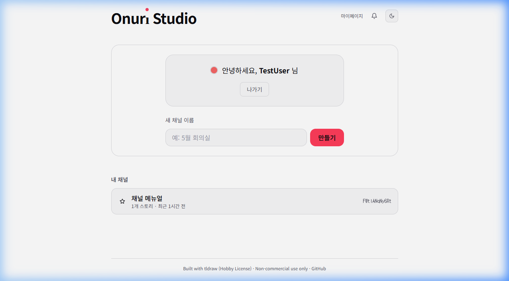
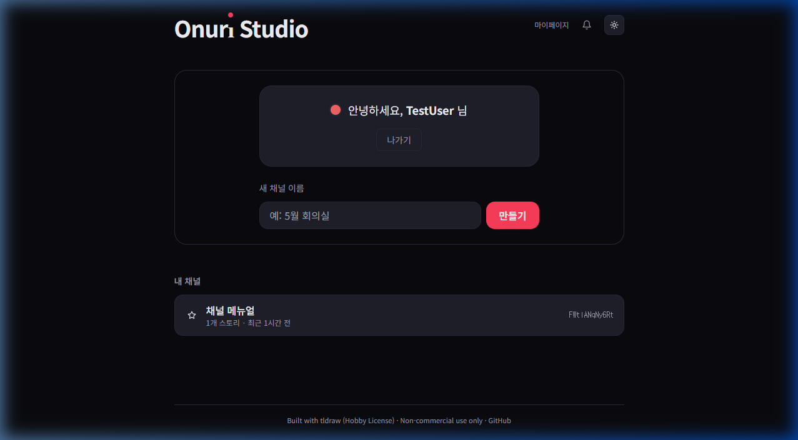

# 📖 Onuri Studio 사용자 매뉴얼

> **Onuri Studio (온누리 스튜디오)** — 모두의 스토리, 우리의 스튜디오.
>
> URL 한 줄로 입장하는 **실시간 협업 화이트보드** 플랫폼입니다.

**접속 주소**: [https://onuri-studio.vercel.app](https://onuri-studio.vercel.app)

> [!NOTE]
> 현재 테스트 모드로 일부 사용자만 사용 중이며, **익명(닉네임)** 및 **Google 로그인** 두 가지 인증 방식을 지원합니다.

---

## 📋 목차

| # | 페이지/기능 | 바로가기 |
|---|-----------|---------|
| 1 | 시작하기 — 랜딩 페이지 | [바로가기](#1-시작하기--랜딩-페이지) |
| 2 | 홈 화면 (대시보드) | [바로가기](#2-홈-화면-대시보드) |
| 3 | 채널 가이드 페이지 | [바로가기](#3-채널-가이드-페이지) |
| 4 | 스토리 화이트보드 | [바로가기](#4-스토리-화이트보드) |
| 5 | 마이페이지 | [바로가기](#5-마이페이지) |
| 6 | 실시간 협업 (Realtime) | [바로가기](#6-실시간-협업-realtime) |
| 7 | 다크/라이트 모드 | [바로가기](#7-다크라이트-모드) |
| 8 | 내보내기/가져오기 | [바로가기](#8-내보내기가져오기) |
| 9 | 권한 관리 시스템 | [바로가기](#9-권한-관리-시스템) |
| 10 | 알림 시스템 | [바로가기](#10-알림-시스템) |
| 11 | Google Drive 연동 | [바로가기](#11-google-drive-연동) |
| 12 | 표 도구 (TableShape) | [바로가기](#12-표-도구-tableshape) |
| 13 | 관리자 페이지 (/admin) | [바로가기](#13-관리자-페이지-admin) |
| 14 | 보안 & 인프라 | [바로가기](#14-보안--인프라) |
| 15 | 기술 스택 | [바로가기](#15-기술-스택) |
| 16 | FAQ | [바로가기](#16-faq--자주-묻는-질문) |

---

## 1. 시작하기 — 랜딩 페이지

사이트에 처음 접속하면 아래와 같은 랜딩 페이지가 표시됩니다.



### 화면 구성

| 영역 | 설명 |
|------|------|
| **Onuri Studio 로고** | 좌측 상단 브랜드 워드마크. "i"의 빨간 점(accent-rec `#FF3D5A`)이 특징 |
| **태그라인** | "모두의 스토리, 우리의 스튜디오." |
| **닉네임 입력란** | 원하는 닉네임을 입력합니다 (예: 누리) |
| **[스튜디오 켜기] 버튼** | 닉네임을 입력하고 이 버튼을 누르면 익명 사용자로 입장 |
| **[Google 로 로그인] 버튼** | Google 계정 SSO 로그인 |
| **🌙 다크/라이트 토글** | 우측 상단 아이콘으로 테마 전환 |

### 입장 방법

**방법 1: 익명 (닉네임) 입장**
1. **닉네임** 입력란에 원하는 이름을 입력합니다.
2. **[스튜디오 켜기]** 버튼을 클릭합니다.
3. 자동으로 고유 색상이 배정되며 (채널 내 색상 충돌 회피 알고리즘 적용), 대시보드로 이동합니다.

**방법 2: Google 로그인**
1. **[Google 로 로그인]** 버튼을 클릭합니다.
2. Google OAuth 인증을 완료합니다.
3. `/auth/setup-nickname` 페이지에서 사용할 닉네임을 입력합니다.
4. 완료 후 대시보드로 자동 이동합니다.

> [!TIP]
> 채널 URL을 받은 사용자가 아직 미인증 상태라면, middleware가 자동으로 랜딩 페이지로 리다이렉트하면서 `?next=` 파라미터로 원래 URL을 보존합니다. 닉네임 입력 완료 후 자동으로 해당 채널로 이동합니다.

---

## 2. 홈 화면 (대시보드)

로그인 후 표시되는 메인 화면입니다. 채널 생성과 관리가 이루어집니다.



### 화면 구성

| 영역 | 설명 |
|------|------|
| **헤더** | 로고 + [마이페이지] 링크 + 🔔 알림 벨 + 🌙 테마 토글 |
| **환영 카드** | "안녕하세요, {닉네임} 님" + 사용자 고유 색상 도트 + [나가기] 버튼 |
| **새 채널 이름** | 채널 생성 입력란 (예: 5월 회의실) |
| **[만들기] 버튼** | Rate Limit 적용: 분당 5회 제한 |
| **내 채널 목록** | 내가 만들거나 참여한 채널 카드 — ☆ 즐겨찾기, 스토리 수, 최근 활동 시간, 채널 ID |

### 채널 만들기

새 채널을 만드는 과정을 보여주는 데모:



1. **새 채널 이름** 입력란에 원하는 채널 이름을 입력합니다.
2. **[만들기]** 버튼을 클릭합니다.
3. 채널 ID(nanoid 12자)가 자동 생성되며, 채널 가이드 페이지로 이동합니다.

> [!IMPORTANT]
> - 채널 이름에 `<` `>` 등의 특수문자는 XSS 방지를 위해 사용할 수 없습니다.
> - 채널 생성은 분당 5회로 Rate Limit이 적용됩니다.

---

## 3. 채널 가이드 페이지

개별 채널의 상세 페이지입니다. 스토리를 만들고, 관리하고, 공유합니다.



### 화면 구성

| 영역 | 설명 |
|------|------|
| **채널 제목** | 채널 이름 + 생성자 (by {닉네임}) + ☆ 즐겨찾기 토글 |
| **채널 ID** | 고유 식별자 (예: `FWtlANqNy6Rt`) — nanoid 12자 (~63bit 엔트로피) |
| **[🔗 채널 URL 공유]** | 채널 URL을 클립보드에 복사 |
| **편집 권한 표시** | 🟢 "내 채널 (편집 가능)" 또는 "읽기 전용" |
| **스토리 카드** | 기존 스토리 목록 — 미리보기, 제목, 마지막 수정 시간 |
| **[+ 새 스토리]** | 새 스토리(화이트보드) 생성 (분당 20회 Rate Limit) |
| **[.onuri.json 가져오기]** | 드래그앤드롭 또는 클릭으로 파일 가져오기 |

### 스토리 관리

| 기능 | 설명 |
|------|------|
| **새 스토리 만들기** | [+ 새 스토리] 클릭 → 자동 제목 부여 ("이름 N") → 화이트보드 이동 |
| **스토리 열기** | 스토리 카드 클릭 → 화이트보드 페이지 이동 |
| **스토리 삭제** | 스토리 카드에서 삭제 버튼 (채널 소유자만 가능) |
| **.onuri.json 가져오기** | 파일 드래그 또는 클릭 → 병합/새 스토리 선택 다이얼로그 |

### 채널 공유

1. **[채널 URL 공유]** 버튼 클릭 → URL이 클립보드에 복사됩니다.
2. URL을 받은 사람은 닉네임 입력 후 자동으로 해당 채널에 입장합니다.
3. 방문 기록은 `participations` 테이블에 자동 기록됩니다.

---

## 4. 스토리 화이트보드

Onuri Studio의 **핵심 기능**인 실시간 협업 화이트보드입니다. [tldraw](https://tldraw.dev) 엔진 기반으로 다양한 그리기 도구를 제공합니다.

### 입장 시 도움말

스토리에 처음 입장하면 간단한 사용법 안내가 표시됩니다:



| 기능 | 설명 |
|------|------|
| ✏️ **펜** | 자유 곡선. 길게 그리면 자동 보정 |
| □ **도형** | 사각형 · 원 · 화살표 · 텍스트 등 |
| 📝 **메모지** | 클릭 후 글자 입력. 우하단에 작성자 닉네임 표시 (customNoteShapeUtil) |
| 🎨 **색상** | 기본 12색 + 무지개🌈 클릭으로 HTML color picker (전체 도형 임의 색 지원, D-011) |
| ⚡ **레이저** | 헤더 ⚡ 토글로 전체 공유 모드 — SVG 글로우 오버레이로 함께 가리킴 |
| 🔗 **공유** | "스토리 URL 공유" 버튼으로 URL 복사 → 실시간 협업 시작 |

**[시작하기]** 버튼을 누르면 도움말이 닫힙니다. 도형 하나를 그리면 이 안내는 다시 나타나지 않습니다.

### 화이트보드 메인 화면



### 도형 그리기 예시

아래는 실제 사각형과 텍스트를 그린 예시입니다:



### 헤더 영역 상세

| 요소 | 설명 |
|------|------|
| **← 채널명** | 채널 가이드 페이지로 돌아가기 |
| **스토리 제목** | 클릭하여 인라인 편집 (상태 머신: idle → editing → saving). Enter로 저장, Esc로 취소, 빈 값 롤백 |
| **접속 중 N명** | 현재 접속 사용자 수 + 색상 도트 (PresenceList 컴포넌트) |
| **🟢 실시간** | Supabase Realtime broadcast 연결 상태 |
| **⚡ 레이저: 본인만/전체** | 레이저 포인터 모드 전환 (공유 시 60Hz→30Hz 스로틀, D-017) |
| **📤 내보내기** | `.onuri.json` / `.png` / `.svg` 내보내기 |
| **🔗 스토리 URL 공유** | 스토리 고유 URL 클립보드 복사 |
| **사용자 정보** | 닉네임 + 고유 색상 도트 + [나가기] |

### 하단 도구 바 (CustomToolbar — 70vw 확장, D-019)

`maxItems=20 / maxSizePx=1200` 으로 와이드 스크린에서 거의 모든 도구 인라인 노출:

| 도구 | 단축키 | 설명 |
|------|--------|------|
| 🖱 선택 | `V` | 오브젝트 선택/이동 |
| ✋ 손바닥 | `H` | 캔버스 드래그 이동 |
| ✏️ 펜 | `D` | 자유 곡선 그리기 |
| ✏️ 형광펜 | — | 반투명 하이라이트 |
| 🧹 지우개 | `E` | 오브젝트 지우기 |
| ↗ 화살표 | `A` | 화살표 그리기 |
| T 텍스트 | `T` | 텍스트 입력 |
| 💬 메모지 | `N` | 스티키 노트 (작성자 닉네임 자동 표시) |
| 🖼 이미지 | — | 이미지 업로드 |
| □ 사각형 | `R` | 사각형 도형 |
| ○ 원 | `O` | 원 도형 |
| ◇ 마름모 | — | 마름모 도형 |
| △ 삼각형 | — | 삼각형 도형 |
| ⭐ 별 | — | 별 도형 |
| ❤ 하트 | — | 하트 도형 |
| ☁ 구름 | — | 구름 도형 |
| ☑ 체크박스 | — | 체크박스 도형 |
| 📊 표 | — | 표 도구 (TableShape, D-019) |

### 우측 스타일 패널 (CustomStylePanel)

| 옵션 | 설명 |
|------|------|
| **색상 팔레트** | 12색 기본 + 무지개🌈 클릭 시 HTML 컬러 피커 (D-011: `shape.meta.customColor`에 hex 저장) |
| **투명도** | 슬라이더로 0~100% 조절 |
| **채우기** | 실선 · 빈칸 · 반투명 · 패턴 |
| **외곽선** | 실선 · 점선 · 없음 |
| **크기** | S · M · L · XL |
| **폰트** | 4종 폰트 스타일 |
| **정렬** | 좌 · 중앙 · 우 · 양쪽 정렬 |

### 페이지 관리 (좌측 상단)

- **Page 드롭다운**: 여러 페이지 전환
- **↩ 실행 취소** / **↪ 다시 실행**: Ctrl+Z / Ctrl+Y
- **🗑 삭제** · **📋 복제** · **⋮ 더보기**: 오브젝트 조작

### 자동 저장

> [!NOTE]
> 모든 편집 내용은 **1.5초 debounce로 자동 저장**됩니다. D-017 Smart autosave: 다른 사용자가 그리는 중에는 저장을 연기하여, owner snapshot 덮어쓰기 손실을 방지합니다.

---

## 5. 마이페이지

사용자 정보, 채널 관리, Google 계정 연결, 권한 이력을 확인할 수 있는 페이지입니다.



### 화면 구성

| 섹션 | 설명 |
|------|------|
| **계정 정보** | 닉네임 (인라인 편집 가능, `NicknameEditInline`), 배정 색상(hex), 인증 방식 (ProviderBadge), 연결된 제공자 |
| **Google 계정 연결** | [Google 계정 연결] 버튼 → 익명 데이터를 Google 계정에 흡수 (`transfer-anonymous-to-user.ts`) |
| **내가 만든 채널** | 본인이 생성한 채널 목록 |
| **Drive Workspace 설정** | Google 사용자에게만 표시 — `GDriveWorkspaceSection` |
| **권한 이력** | D-015: 받은 편집 권한 / 부여한 편집 권한 목록 + 해제 기능 (`PermissionHistorySection`) |
| **즐겨찾기** | ☆ 표시한 채널 목록 |
| **최근 방문** | 방문한 채널 히스토리 (본인 채널은 중복 제외) |

### Google 계정 연결 (익명→회원 전환)

1. 마이페이지에서 **[Google 계정 연결]** 클릭
2. Google 로그인 완료
3. `anonymous_sessions.converted_user_id` 설정 + `channels.owner_id`, `participations.user_id` 일괄 업데이트
4. 기존 익명 데이터(채널, 스토리, 활동 기록)가 Google 계정에 자동 흡수

> [!CAUTION]
> 익명 사용자의 데이터는 **브라우저 쿠키에 묶여** 있습니다. 브라우저 데이터를 삭제하면 접근할 수 없게 됩니다. 중요한 작업은 반드시 Google 계정을 연결하세요.

---

## 6. 실시간 협업 (Realtime)

Supabase Realtime broadcast + presence 기반의 실시간 동기화 시스템입니다.

### 핵심 기능

| 기능 | 구현 | 제한 |
|------|------|------|
| **실시간 동기화** | tldraw store diff → broadcast (last-write-wins) | — |
| **Presence 커서** | 다른 사용자의 커서 위치 + 닉네임 라벨 (PresenceLayer) | 15Hz 스로틀 |
| **On Air 표시** | `presence.isDrawing` 기반 빨간 펄스 (OnAirIndicator) | — |
| **레이저 포인터** | 공유/비공유 모드 + SVG 글로우 오버레이 (RemoteLaserLayer) | 30Hz 스로틀 |
| **Broadcast throttle** | 50ms batching + dedupe | — |
| **정원 제한** | `MAX_STORY_PRESENCES = 25` | 초과 시 OverflowNotice |
| **Non-destructive reconnect** | replace → merge + catch-up broadcast | — |

### 동기화 아키텍처

```
[사용자 A 편집]
   ↓ store diff 감지 (addedRecords / updatedRecords / removedRecords)
   ↓ 50ms batching + dedupe
   ↓ Supabase Realtime broadcast
   ↓
[사용자 B 수신]
   ↓ editor.store.mergeRemoteChanges() — 무한 루프 방지
   ↓ 렌더링
```

### Channel Guide 라이브 도트

채널 가이드 페이지에서 각 스토리 카드에 **라이브 접속자 도트**가 표시됩니다. `useChannelPresence` 훅으로 별도의 presence 채널을 구독합니다.

---

## 7. 다크/라이트 모드

D-012 결정에 따라 구현된 테마 전환 기능입니다.

| 라이트 모드 | 다크 모드 |
|------------|----------|
|  |  |

### 구현 상세

| 항목 | 내용 |
|------|------|
| **메커니즘** | `html[data-theme]` CSS 변수 분기 |
| **자동 감지** | `prefers-color-scheme` 시스템 환경 설정 감지 |
| **영속화** | localStorage + cookie 이중 저장 |
| **토글 UI** | 헤더의 ☀/🌙 아이콘 (ThemeToggle 컴포넌트) |
| **accent 공유** | 라이트/다크 모드에서 `--accent-rec` (`#FF3D5A`) 공유 |
| **화이트보드** | 스토리(화이트보드) 페이지는 항상 **다크 모드 고정** |

---

## 8. 내보내기/가져오기

### 내보내기 형식

| 형식 | 확장자 | 용도 |
|------|--------|------|
| **OnuriFile v1** | `.onuri.json` | Onuri Studio 전용 포맷. tldraw snapshot + 메타데이터. 다른 채널/사용자에게 공유 가능 |
| **이미지** | `.png` | 래스터 이미지로 내보내기 |
| **벡터** | `.svg` | 벡터 이미지로 내보내기 |

### OnuriFile 스키마

```json
{
  "$schema": "https://onuri.studio/schema/onuri-file/v1",
  "version": 1,
  "meta": {
    "exportedAt": "2026-05-15T12:00:00Z",
    "exportedBy": { "nickname": "누리" },
    "appVersion": "0.1.0"
  },
  "story": {
    "title": "스토리 제목",
    "yDocBase64": "..."
  }
}
```

### 가져오기

- 채널 가이드 페이지의 **[.onuri.json 가져오기]** 영역에 파일 드래그 또는 클릭
- Import 시 **병합/새 스토리 선택** 다이얼로그 표시
- zod 스키마로 파일 검증 (크기 한도: 10MB)

### 권한 정책 (D-014)

- **익명 + 비-owner 채널**: ExportButton 숨김
- **채널 소유자**: 모든 Export 형식 사용 가능
- Google Drive 첨부 파일 정보 (`fileId`/`embedUrl`)는 Export 시 제거 + `imported` flag 추가

---

## 9. 권한 관리 시스템

D-015 결정에 따라 구현된 **스토리 단위** 수정 권한 시스템입니다.

### 권한 흐름

```
[비-owner 사용자]
  ↓ 우상단 "읽기 전용" 배지 클릭
  ↓ edit_request 알림 생성 → owner에게 전송
  ↓
[owner]
  ↓ 🔔 알림에서 "허용" 클릭
  ↓ story_permissions.editor 부여
  ↓ 요청자에게 승인 알림 전송
  ↓
[비-owner 사용자]
  ↓ 알림 클릭 → 페이지 리로드 → 편집 가능
```

### 특징

| 항목 | 내용 |
|------|------|
| **범위** | 스토리 단위 / 영구 / DB `story_permissions` 테이블 보관 |
| **알림 전송** | Realtime broadcast 채널 `user-notifications:{userId}` |
| **익명 지원** | 익명 사용자도 Supabase 세션 부재 우회하여 알림 수신 가능 |
| **권한 요청** | Rate Limit 5회/분 |
| **권한 해제** | 마이페이지 권한 이력 섹션에서 가능 |

---

## 10. 알림 시스템

실시간 알림 기능입니다.

### 알림 유형

| 유형 | 발생 조건 | 수신자 |
|------|----------|--------|
| **수정 권한 요청** | 비-owner가 "읽기 전용" 배지 클릭 | 채널 owner |
| **수정 권한 승인** | owner가 요청 "허용" 시 | 요청자 |

### 구현

- **NotificationBell** 컴포넌트: 🔔 아이콘 + 읽지 않은 알림 수 배지
- **Realtime push**: `broadcast` 채널 `user-notifications:{userId}` 사용
- 익명/Google 사용자 모두 동일 UX

---

## 11. Google Drive 연동

D-018 결정에 따라 구현된 Google Workspace 연동입니다 (Google 로그인 사용자 전용).

### Phase 8a — URL 붙여넣기 + 임베드

| 기능 | 설명 |
|------|------|
| **URL 감지** | Google Sheets/Docs/Slides/Drive 공유 링크 자동 파싱 |
| **gdrive-file shape** | tldraw custom shape — mime type별 아이콘/색상 (`gdriveShapeUtil.tsx`) |
| **Split-screen iframe** | 클릭 시 Sheets `/edit`, 그 외 `/preview`로 분할 패널 열기 |
| **Resize 핸들** | 좌측 핸들로 패널 너비 조절 가능 |

### Phase 8b — Picker + 폴더 자동 생성

| 기능 | 설명 |
|------|------|
| **Google Picker SDK** | Drive 파일 브라우저로 파일 선택 |
| **폴더 자동 생성** | `{workspace}/{채널 [id]}/{스토리 [id]}/` 구조로 Drive 폴더 생성 |
| **Shortcut 첨부** | 원본 보존 + Drive shortcut 생성 |
| **권한 자동 설정** | 폴더 단위 anyone-with-link viewer share |
| **onDelete cleanup** | shape 삭제 시 DB row + Drive shortcut 자동 정리 |
| **Workspace 설정** | 마이페이지에서 Drive Workspace 경로 설정 |

> [!NOTE]
> 모든 Drive API 호출은 **client-side**에서 `session.provider_token` + `gapi.client.drive`를 사용합니다. 서버 측 token 암호화/refresh 불필요.

---

## 12. 표 도구 (TableShape)

D-019 결정에 따라 구현된 커스텀 표 도구입니다 (`tableShapeUtil.tsx`).

### 기능

| 기능 | 설명 |
|------|------|
| **인라인 편집** | 셀 더블클릭 → `<textarea>` 편집 (Enter 저장 / Tab 다음 셀 / Esc 취소) |
| **열/행 크기 조절** | 셀 경계 호버 → ↔/↕ 커서 → 드래그로 크기 조정 |
| **행/열 추가·삭제** | 표 선택 시 외곽 +/- 원형 버튼 4개 (max 50×20) |
| **비례 리사이즈** | 코너 핸들로 표 전체 비례 리사이즈 (onResize override) |
| **실시간 동기화** | props (`rows`/`cols`/`cells`/`colWidths`/`rowHeights`) 모두 직렬화 가능 → 기존 broadcast sync 자동 처리 |

> Google Sheets 첨부(D-018)와 병행 — 빠른 메모에는 표 도구, 본격 데이터 작업에는 Sheets 연동.

---

## 13. 관리자 페이지 (/admin)

`role=admin` 사용자만 접근 가능한 시스템 관리 페이지입니다.

### 기능

| 기능 | 설명 |
|------|------|
| **대시보드 통계** | 총 사용자 수, 채널 수, 스토리 수 등 (`getAdminDashboard`) |
| **Supabase 무료 티어 사용량** | DB 용량 추정 / Auth 사용자 수 / 테이블별 row count + Supabase Dashboard 링크 |
| **사용자 검색** | 닉네임, 이메일로 사용자 검색 |
| **채널/스토리 검색** | 이름, ID로 채널/스토리 검색 |

> [!NOTE]
> 관리자 권한 부여는 현재 SQL 직접 실행 (`UPDATE users SET role = 'admin' WHERE id = '...'`). 사용자 증가 시 `/admin/promote` UI 추가 예정 (D-008).

---

## 14. 보안 & 인프라

### Row Level Security (RLS)

모든 주요 테이블에 RLS 정책이 적용되어 있습니다:

| 테이블 | 정책 |
|--------|------|
| `users` | 본인 read/update, admin 전체 read |
| `channels` | 누구나 read (URL 알면), owner만 write |
| `stories` | 누구나 read, 채널 소유자만 write |
| `participations` | 본인 것만 접근 |
| `story_permissions` | 관련자만 접근 |
| `notifications` | 수신자만 접근 |

### Rate Limiting

Supabase Postgres 기반 ($0 예산):

| 액션 | 한도 |
|------|------|
| 채널 생성 | 5회/분 |
| 스토리 생성 | 20회/분 |
| 권한 요청 | 5회/분 |

### 보안 정책

| 위협 | 완화 |
|------|------|
| XSS | zod 입력 검증 + `<>` 거부 + React JSX 자동 escape (3중 방어) |
| 채널 ID 추측 | nanoid 12자 (~63bit 엔트로피) |
| CSRF | Server Action 토큰 + SameSite=Lax |
| Open redirect | sign-in `next` 파라미터 — 같은 origin path만 허용 |
| Service Role Key 유출 | ESLint custom rule로 클라이언트 import 차단 |
| tldraw 직접 import | ESLint rule 강제 — `@/lib/editor`만 허용 (D-016 abstraction) |

### Editor Abstraction (D-016)

tldraw 사용 표면을 `lib/editor/index.ts`에 한곳에 re-export. 9개 소비처는 `@/lib/editor`만 import합니다. 미래 editor 교체(Excalidraw 등) 시 이 파일에 동일 시그니처 adapter만 만들면 swap 가능합니다.

---

## 15. 기술 스택

| 영역 | 기술 | 비용 |
|------|------|------|
| **프론트엔드** | Next.js 14 App Router + TypeScript + TailwindCSS | 무료 |
| **UI 컴포넌트** | shadcn/ui | 무료 |
| **캔버스 엔진** | tldraw (Hobby License, 비상업적) | 무료 |
| **실시간 동기화** | Supabase Realtime (broadcast + presence) | 무료 |
| **DB + 인증** | Supabase Free (500MB / 50K MAU) | 무료 |
| **호스팅** | Vercel Hobby | 무료 |
| **패키지 매니저** | pnpm | 무료 |
| **입력 검증** | zod | 무료 |
| **ID 생성** | nanoid | 무료 |

### 아키텍처

```
Client (Browser)
  ├── Next.js App (App Router)
  ├── tldraw Canvas (editor abstraction)
  └── Supabase Realtime (broadcast + presence)
         ↕
Server (Vercel Edge + Supabase)
  ├── Server Actions / Route Handlers
  ├── Supabase Auth (Anonymous + Google SSO)
  ├── Supabase Postgres (RLS 적용)
  └── Rate Limit (Postgres 기반)
```

### 레이어 구조

| 레이어 | 책임 | 위치 |
|--------|------|------|
| Presentation | UI, 라우팅, 디자인 토큰 | `app/`, `components/` |
| Application | 유즈케이스, 훅 | `lib/usecases/`, `lib/hooks/` |
| Domain | 엔티티, 타입, 비즈니스 규칙 | `lib/domain/` |
| Infrastructure | Supabase, Auth 어댑터 | `lib/infra/` |

---

## 16. FAQ / 자주 묻는 질문

**Q: 닉네임을 바꿀 수 있나요?**
A: 마이페이지에서 닉네임 옆 편집 아이콘을 클릭하여 변경할 수 있습니다 (`NicknameEditInline` 컴포넌트).

**Q: 다른 사람의 채널에서 편집할 수 있나요?**
A: 기본적으로 채널 소유자만 편집 가능합니다. 화이트보드에서 "읽기 전용" 배지를 클릭하면 소유자에게 편집 권한을 요청할 수 있습니다. 승인 시 알림을 통해 통보됩니다.

**Q: 동시에 몇 명까지 접속 가능한가요?**
A: 한 스토리당 **최대 25명** (D-017). 초과 시 OverflowNotice가 표시되며 "다시 시도" 버튼만 제공됩니다. 50명 운영이 필요하면 Yjs CRDT 마이그레이션이 필요합니다.

**Q: 편집 내용은 자동 저장되나요?**
A: 네, **1.5초 debounce**로 자동 저장됩니다. Smart autosave가 적용되어 다른 사용자가 그리는 중에는 저장을 연기하여 데이터 손실을 방지합니다.

**Q: 모바일에서도 사용 가능한가요?**
A: 네. safe-area + viewport + 헤더 wrap 대응이 적용되어 모바일/태블릿에서도 사용 가능합니다.

**Q: 데이터가 안전한가요?**
A: Row Level Security(RLS), XSS 3중 방어, Rate Limit, Service Role Key 격리 등 다층 보안이 적용되어 있습니다.

**Q: 오프라인에서 사용 가능한가요?**
A: 현재 오프라인 전용 모드는 지원하지 않습니다. 인터넷 연결이 끊긴 경우 재연결 시 non-destructive reconnect(merge + catch-up)로 데이터를 복구합니다.

**Q: 상업적 사용이 가능한가요?**
A: tldraw Hobby License는 비상업적 사용만 허용합니다. 상업 전환(수익화/회사 운영/광고 등) 시 [tldraw SDK License](https://tldraw.dev/community/license) 별도 구매가 필요합니다.

---

*본 매뉴얼은 2026년 5월 15일 기준으로 작성되었습니다.*
*Onuri Studio v0.1.0 · 전체 진행률 78% (Phase 1~6 MVP 98%, Phase 7~9 확장 37%)*
*접속 주소: [https://onuri-studio.vercel.app](https://onuri-studio.vercel.app)*
